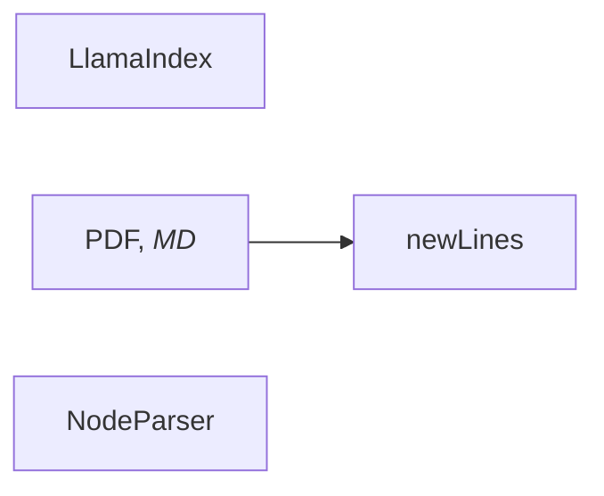

# 2.1 用大模型构建新人答疑机器人

## 1.大模型是如何工作的


### 2.1. 大模型的问答工作流程

下面以“ACP is a very”为输入文本向大模型发起一个提问，下图展示从发起提问到输出文本的完整流程。

[](https://img.alicdn.com/imgextra/i1/O1CN01yLBhyu1gSAlt3oI0p_!!6000000004140-2-tps-2212-1070.png)

大模型的问答工作流程有以下五个阶段：

1. 输入文本的分词化：

   分词（Token）是大模型处理文本的基本单元，通常是词语、词组或者符号。

   ```mermaid
   sequenceDiagram
       提示词->>+1.文本分词化-tokenization: ACP is a very
       1.文本分词化-tokenization->>+2.分词向量化-embedding: token: [ACP， is， a， very]
      2.分词向量化-embedding ->>+3.大模型推理: token IDs:  [2321, 6423, 1842, 134]
      3.大模型推理->>+4.输出Token: 输出候选Token:[ACP， is， a， very，informative]
      4.输出Token->>+3.大模型推理: 输出候选Token:[ACP， is， a， very，informative]
      3.大模型推理->>+4.输出Token: 输出候选Token:[ACP， is， a， very，informative, course]
      4.输出Token->>+3.大模型推理: 输出候选Token:[ACP， is， a， very，informative, course，。]
      3.大模型推理->>+4.输出Token: 输出特殊Token：[ACP， is， a， very，informative, course，。]
      4.输出Token->>+5.输出文本:  ACP is a very informative course。
   ```

   

   我们需要将“ACP is a very”这个句子分割成更小且具有独立语义的词语（Token），并且为每个Token分配一个ID。

   **第一阶段：输入文本分词化**

   分词（Token）是大模型处理文本的基本单元，通常是词语、词组或者符号。我们需要将“ACP is a very”这个句子分割成更小且具有独立语义的词语（Token），并且为每个Token分配一个ID。如果您对通义千问的tokenizer细节感兴趣，请参考：[Tokenization](https://github.com/QwenLM/Qwen/blob/main/tokenization_note_zh.md)。

   **第二阶段：Token向量化**

   计算机只能理解数字，无法直接理解Token的含义。因此需要将Token进行数字化转换（即转化为向量），使其可以被计算机所理解。Token向量化会将每个Token转化为固定维度的向量。

   **第三阶段：大模型推理**

   大模型通过大量已有的训练数据来学习知识，当我们输入新内容，比如“ACP is a very”时，大模型会结合所学知识进行推测。它会计算所有可能Token的概率，得到候选Token的概率集合。最后，大模型通过计算选出一个Token作为下一个输出。

   这就解释了为什么当询问公司的项目管理工具时，模型无法提供内部工具的建议，这是因为其推测能力是基于已有的训练数据，对它未接触的知识无法给出准确的回答。因此，在需要答疑机器人回答私域知识时，需要针对性地解决这一问题，在本小节第3部分会进一步阐述。

   **第四阶段：输出Token**

   由于大模型会根据候选Token的概率进行随机挑选，这就会导致“即使问题完全相同，每次的回答都略有不同”。为了控制生成内容的随机性，目前普遍是通过temperature和top_p来调整的。

   例如，下图中大模型输出的第一个候选Token集合为“informative（50%）”、“fun（25%）”、“enlightening（20%）”、“boring（5%）”。通过调整**temperature**或**top_p**参数，将影响大模型在候选Token集合中的选择倾向，如选择概率最高的“informative”。你可以在本小节 2.2 中进一步了解这两个参数。

   [](https://img.alicdn.com/imgextra/i3/O1CN01N93ZE81e6zAZA4TiK_!!6000000003823-0-tps-582-340.jpg)

   特别地，“informative”会被继续送入大模型，用于生成候选Token。这个过程被称为**自回归**，它会利用到输入文本和已生成文本的信息。大模型采用这种方法依次生成候选Token。

   **第五阶段：输出文本**

   循环第三阶段和第四阶段的过程，直到输出**特殊Token**（如，end of sentence，即“**句子结束**”标记）或输出**长度达到阈值**，从而结束本次问答。大模型会将所有生成的内容输出。当然你可以使用大模型的**流式输出能力**，即预测一些Token立即进行返回。这个例子最终会输出“ACP is a very informative course.”。

2. ### 2.2 影响大模型内容生成的随机性参数

   假设在一个对话问答场景中，用户提问为：“在大模型ACP课程中，你可以学习什么？”。为了模拟大模型生成内容的过程，我们预设了一个候选Token集合，这些Token分别为：“RAG”、“提示词”、“模型”、“写作”、“画画”。大模型会从这5个候选Token中选择一个作为结果输出（next-token），如下所示。

   > 用户提问：在大模型ACP课程中，你可以学习什么？
   >
   > 大模型回答：RAG

   在这个过程中，有两个重要参数会影响大模型的输出：**temperature** 和 **top_p**，它们用来控制大模型生成内容的**随机性**和**多样性**。下面介绍这两个参数的工作原理和使用方式。

   #### 2.2.1 temperature：调整候选Token集合的概率分布

   在大模型生成下一个词（next-token）之前，它会先为候选Token计算一个初始概率分布。这个分布表示每个候选Token作为next-token的概率。**temperature是一个调节器，它通过改变候选Token的概率分布，影响大模型的内容生成**。通过调节这个参数，你可以灵活地控制生成文本的多样性和创造性。

   为了更直观地理解，下图展示了不同temperature值对候选Token概率分布的影响。绘图代码放置在 /resources/2_1 文件目录下。

   [](https://img.alicdn.com/imgextra/i4/O1CN0137QeqL1o3uhFmaXHU_!!6000000005170-0-tps-3538-1242.jpg)

   图中的低、中、高温度基于通义千问Max模型的范围[0, 2)划分。

   由上图可知，温度从低到高（0.1 -> 0.7 -> 1.2），概率分布从陡峭趋于平滑，候选Token“RAG”从出现的概率从0.8 -> 0.6 -> 0.3，虽然依然是出现概率最高的，但是已经和其它的候选Token概率接近了，最终输出也会从相对固定到逐渐多样化。

   针对不同使用场景，可参考以下建议设置 temperature 参数：

   - 明确答案（如生成代码）：调低温度。
   - 创意多样（如广告文案）：调高温度。
   - 无特殊需求：使用默认温度（通常为中温度范围）。

   需要注意的是，当 temperature=0 时，虽然会最大限度降低随机性，但无法保证每次输出完全一致。如果想深入了解，可查阅 [temperature的底层算法实现](https://github.com/huggingface/transformers/blob/v4.49.0/src/transformers/generation/logits_process.py#L226)。

   从实验中可以明显观察到，温度值越高，模型生成的内容更具变化和多样性。

```mermaid

```

#### 2.2.2 top_p：控制候选Token集合的采样范围

**top_p 是一种筛选机制**，用于从候选 Token 集合中选出符合特定条件的“小集合”。具体方法是：**按概率从高到低排序，选取累计概率达到设定阈值的 Token 组成新的候选集合，从而缩小选择范围**。

下图展示了不同top_p值对候选Token集合的采样效果。

[](https://img.alicdn.com/imgextra/i1/O1CN01xmkonv21sNL6VtQpi_!!6000000007040-0-tps-2732-1282.jpg)

图示中蓝色部分表示累计概率达到top_p阈值（如0.5或0.8）的Token，它们组成新的候选集合；灰色部分则是未被选中的Token。

当top_p=0.5时，模型优先选择最高概率的Token，即“RAG”；而当top_p=0.8时，模型会在“RAG”、“提示词”、“模型”这三个Token中随机选择一个生成输出。

由此可见，top_p值对大模型生成内容的影响可总结为：

- 值越大 ：候选范围越广，内容更多样化，适合创意写作、诗歌生成等场景。
- 值越小 ：候选范围越窄，输出更稳定，适合新闻初稿、代码生成等需要明确答案的场景。
- 极小值（如 0.0001）：理论上模型只选择概率最高的 Token，输出非常稳定。但实际上，由于分布式系统、模型输出的额外调整等因素可能引入的微小随机性，仍无法保证每次输出完全一致。

下面体验top_p的效果。通过调整top_p值，对同一问题提问10次，观察回答内容的波动情况。

根据实验结果可以发现，**top_p值越高，大模型的输出结果随机性越高**。

#### 2.2.3 小结

**是否需要同时调整temperature和top_p？**

为了确保生成内容的可控性，建议不要同时调整top_p和temperature，同时调整可能导致输出结果不可预测。你可以优先调整其中一种参数，观察其对结果的影响，再逐步微调。

> 
> **知识延展：top_k**
> 在通义千问系列模型中，参数top_k也有类似top_p的能力，可查阅[通义千问API文档](https://help.aliyun.com/zh/model-studio/developer-reference/use-qwen-by-calling-api?spm=a2c4g.11186623.help-menu-2400256.d_3_3_0.68332bdb2Afk2s&scm=20140722.H_2712576._.OR_help-V_1)。它是一种采样机制，从概率排名前k的Token中随机选择一个进行输出。一般来说，top_k越大，生成内容越多样化；top_k越小，内容则更固定。当top_k设置为1时，模型仅选择概率最高的Token，输出会更加稳定，但也会导致缺乏变化和创意。
>
> **知识延展：seed**
> 在通义千问系列模型中，参数seed也支持控制生成内容的确定性，可查阅[通义千问API文档](https://help.aliyun.com/zh/model-studio/developer-reference/use-qwen-by-calling-api?spm=a2c4g.11186623.help-menu-2400256.d_3_3_0.68332bdb2Afk2s&scm=20140722.H_2712576._.OR_help-V_1)。在每次模型调用时传入相同的seed值，并保持其他参数不变，模型会尽最大可能返回相同结果，但无法保证每次结果完全一致。

**设置 temperature、top_p、seed 控制大模型输出，为何仍存在随机性？**

即使将 temperature 设置为 0、top_p 设置为极小值（如 0.0001），并使用相同的 seed ，同一个问题的生成结果仍可能出现不一致。这是因为一些复杂因素可能引入微小的随机性，例如大模型运行在分布式系统中，或模型输出引入了优化。

举个例子： 分布式系统就像用不同的机器切面包。虽然每台机器都按照相同的设置操作，但由于设备之间的细微差异，切出来的面包片可能还是会略有不同。

## 3. 让大模型能够回答私域知识问题

回到最初的挑战：答疑机器人无法回答“我们公司项目管理用什么工具”这类内部问题。**根本原因在于，大模型的知识来源于其训练数据，这些数据通常是公开的互联网信息，不包含任何特定公司的内部文档、政策或流程**。

你可以把大模型想象成一台刚出厂的超级计算机：它的 CPU（**推理能力**）极其强大，硬盘（**模型权重**）里也预装了海量的通用知识。但对于你公司的“内部资料”，它的硬盘里是空白的。

面对这个问题，**最直观的解决思路就是**：**在运行时，把公司的内部知识临时告诉它**。

### 3.1 初步方案：在提示词中“喂”入知识

你可以来验证这个思路：将公司项目管理工具的说明文档，直接添加到给**模型的指令（System Prompt）中，作为背景知识提供给它**。

在提示词中加入相关的背景知识，大模型确实能够准确回答关于公司内部工具的问题。这个发现令人振奋，似乎你已经找到了解决私域知识问答的钥匙。

然而，当你试图将更多的公司文档（例如几十页的员工手册、上百页的技术规范）都用这种方式“喂”给大模型时，一个新的、更严峻的挑战出现了。

### 3.2 核心瓶颈：有限的上下文窗口

大模型接收我们输入（包括指令、问题和背景知识）的地方，被称为**上下文窗口（Context Window）**。你可以把它理解为计算机的“内存（RAM）”——它的容量是有限的。你无法将整个公司的知识库（成百上千份文档）一次性塞进这个有限的窗口里。一旦输入内容超过模型的最大限制，就会导致错误。这引出了一个核心问题：你需要对放入上下文窗口的内容进行**筛选和管理**。

### 3.3 解决之道：上下文工程 (Context Engineering)

简单粗暴地将信息塞进上下文，除了会超出窗口限制外，还会带来一系列“隐性”问题：

1. **效率低**：上下文越长，大模型处理所需的时间就越长，导致用户等待时间增加。
2. **成本高**：大部分模型是按输入和输出的文本量计费的，冗长的上下文意味着更高的成本。
3. **信息干扰**：**如果上下文中包含了大量与当前问题无关的信息**，就像在开卷考试时给了考生一本错误科目的教科书，**反而会干扰模型的判断，导致回答质量下降**。

你一定会意识到，成功的关键**不在于“喂”给模型多少知识，而在于“喂”得有多准**。

如何在正确的时间，将最相关、最精准的知识，动态地加载到大模型有限的上下文窗口中？——这门系统性地设计、构建和优化上下文的实践，就是**上下文工程（Context Engineering）**。

从这个角度看，**许多大模型应用的失败，并非模型本身不够智能，而是“上下文”的失败**。上下文工程正是释放大模型潜力的关键所在。

那么，上下文工程具体包含哪些技术呢？你可以通过下面这张概念图来快速了解它的核心版图：

#### 上下文工程 (Context Engineering) 的核心技术

它是构建可靠、高效大模型应用的一系列关键技术的总和，主要包括：

- **RAG (检索增强生成)**：从外部知识库（如公司文档）中**检索**信息，为模型提供精准的回答依据。

- **Prompt (提示词工程)**：通过精心设计的**指令**，精确地引导模型的思考方式和输出格式。

- **Tool (工具使用)**：赋予模型调用外部**工具**（如计算器、搜索引擎、API）的能力，以获取实时信息或执行特定任务。

- **Memory (记忆机制)**：为模型建立长短期**记忆**，使其能够在连续对话中理解历史上下文。

  ### 3.4 技术方案：RAG（检索增强生成）

  **RAG（Retrieval-Augmented Generation，检索增强生成）** 就是实现上下文工程的强大技术方案。它的核心思想是：

  在用户提问时，不再将全部知识库硬塞给大模型，而是先**自动检索**出与问题最相关的私有知识片段，然后将这些精准的片段与用户问题合并后，一同传给大模型，从而**生成**最终的答案。这样既避免了提示词过长的问题，又能确保大模型获得相关的背景信息。

  构建一个 RAG 应用通常会分为两个阶段

  #### 第一阶段：建立索引

  建立索引是为了将私有知识文档或片段转换为可以高效检索的形式。通过将**文件内容分割**并转化为**多维向量**（使用专用 Embedding 模型），并结合**向量存储**保留文本的语义信息，方便进行相似度计算。向量化使得模型能够高效检索和匹配相关内容，特别是在处理大规模知识库时，显著提高了查询的准确性和响应速度。

  这些向量经过 Embedding 模型处理后不仅很好地捕捉文本内容的语义信息，而且由于语义已经向量化，标准化，便于之后与检索语义向量进行相关度计算。

#### 第二阶段：检索与生成


**检索生成**是根据用户的提问，从**索引**中检索相关的文档片段，这些片段会与提问一起输入到大模型生成最终的回答。这样大模型就能够回答私有知识问题了。

总的来说，基于 RAG 结构的应用，既避免了将整个参考文档作为背景信息输入而导致的各种问题，又通过检索提取出了与问题最相关的部分，从而提高了大模型输出的准确性与相关性。

## 4. 本节小结

在本节课程中，我们学习了以下内容：

- **如何使用大模型 API**
  通过实际的代码示例，我们掌握了如何通过 API 调用通义千问大模型，并学习了如何通过流式输出来优化用户体验。
- **大模型的工作原理与局限性**
  我们初步探索了**大模型如“黑盒”般的工作流程**，理解了其**回答具有随机性的原因**，并学习了如何**通过调整 temperature 和 top_p 等参数来控制生成内容**。更重要的是，我们直面了**大模型的核心局限**：其知识完全依赖于训练数据，无法获知你公司的内部文档等私域知识。
- **上下文工程（Context Engineering）与 RAG 的核心思想** 为了解决大模型的知识局限性，我们首先尝试了直接在提示词中**“投喂”知识的方法**，但很快就遇到了“上下文窗口限制”的瓶颈。这引出了一个至关重要的概念——**上下文工程**（Context Engineering），即**智能地为大模型筛选、组织和提供最相关背景信息**的核心方法论。作为该思想的具体实现，我们学习了 **RAG（检索增强生成）** 技术方案。通过“先检索、后生成”的模式，RAG 能有效地将精准的**外部知识**与大模型结合，从而在不超出限制的前提下，让模型能够**回答私域知识问题**。

# 2.2 扩展答疑机器人的知识范围

本节你将学习RAG的工作流程，以及如何创建一个RAG应用，使它能够根据公司的制度文件来进行回答。

## 1. RAG的工作原理

你在考试的时候有可能会因为忘记某个概念或公式而失去分数，但考试如果是开卷形式，那么你只需要找到与考题最相关的知识点，并加上你的理解就可以进行回答了。

对于大模型来说也是如此，在训练过程中由于没有见过某个知识点（比如你们公司的制度文件），因此直接向它提问相关问题会得到不准确的答案；如果在大模型生成内容时，像开卷考试一样将相关知识提供给它作为参考，那么大模型回答的质量也就会大幅提高了。

这引出了之前提到的一个核心理念：**上下文工程（Context Engineering）**，专注于为大模型的“**上下文窗口**”填充恰到好处的信息，以引导其完成特定任务。如果信息太少，模型会“不知道”；如果信息太多或无关，模型的性能会下降，成本也会增加。

而我们即将学习的 **RAG（Retrieval Augmented Generation，检索增强生成）**，正是上下文工程中最重要、最有效的技术之一，专门解决大模型“知识不足”的问题。RAG应用通常包含**建立索引**与**检索生成**两部分。

### 1.1 建立索引

你可能会在考试前对参考资料做标记，来帮助你在考试时更容易地找到相关信息。类似的，RAG应用往往也会在回答前就已经做好了标记，这一过程叫做**建立索引**，建立索引包括四个步骤：

1. **文档解析**
   *就像你会将书上看到的视觉信息理解为文字信息一样*，**RAG应用也需要首先将知识库文档进行加载并解析为大模型能够理解的文字形式**。

2. **文本分段**
   你通常不会在做某道题时把整本书都翻阅一遍，而是去查找与问题最相关的几个段落，因此你会先把参考资料做一个大致的分段。类似的，**RAG应用也会在文档解析后对文本进行分段，以便于在后续能够快速找到与提问最相关的内容。**

3. **文本向量化**
   在开卷考试时，你通常会先在参考资料中寻找与问题最相关的段落，再去进行作答。在RAG应用中，通常需要借助**嵌入（embedding）模型**分别对段落与问题进行**数字化**表示，在进行相似度比较后找出最相关的段落，**数字化表示的过程就叫做文本向量化**。

   > 如果你对这一过程的细节感兴趣，可以学习-本教程的拓展阅读部分。

4. **存储索引**
   **存储索引将向量化后的段落存储为向量数据库**，这样RAG应用就无需在每次进行回复时都重复以上步骤，从而可以增加响应速度。

   

   在建立索引后，RAG应用就可以根据用户的问题检索出相关的文本段了。

### 1.2 检索生成

**检索**、**生成**分别对应着**RAG**名字中的`**Retrieval**`与`**Generation**`两阶段。**检索**就像开卷考试时去查找资料的过程，**生成**则是在找到资料后，根据参考资料与问题进行作答的过程。

1. **检索**
   检索阶段会召回与问题最相关的文本段。通过**embedding模型**对问题进行文本向量化，并与向量数据库的段落进行语义相似度的比较，找出最相关的段落。**检索是RAG应用中最重要的环节**，你可以想象如果考试的时候找到了错误的资料，那么回答一定是不准确的。这个步骤完美诠释了上下文工程的精髓：从海量知识中“精准地选择相关信息”来填充上下文。找到最匹配的内容，是保证后续生成质量的第一步。为了提高检索准确性，除了使用性能强大的**embedding模型**，也可以做**重排（rerank）**、**句子窗口检索**等方法，这些内容你可以在之后的章节进行学习。

2. **生成**
   在检索到相关的文本段后，**RAG应用会将问题与文本段通过提示词模板生成最终的提示词**，由**大模型生成回复**，这个阶段更多是利用大模型的总结能力，而不是大模型本身具有的知识。这个提示词模板的设计，是上下文工程的另一个关键环节。我们不仅要提供检索到的“资料”，还要明确地“指导”模型如何使用这些资料来回答问题。

   > 一个典型的提示词模板为：`请根据以下信息回答用户的问题：{召回文本段}。用户的问题是：{question}。`

   

## 2. 创建RAG应用

构建一个RAG应用需要实现以上功能，这个过程并不容易。但通过LlamaIndex，你不需要过多代码就可以完成上述功能。

### 2.3 保存与加载索引

你可能会发现，创建索引消耗的时间比较长。如果能够将索引保存到本地，并在需要使用的时候直接加载，而不是重新建立索引，那就可以大幅提升回复的速度，LlamaIndex提供了简单易实现的保存与加载索引的方法。


## LlamaIndex里有什么


初识 LlamaIndex
LlamaIndex (前身为 GPT Index) 是一个**数据框架**，它诞生的目的是**帮助开发人员将外部数据轻松桥接到大型语言模型 (LLM) 应用中**。它**提供了一种结构化的方法来连接 LLM 与各种数据资源**，从而使 LLM 能够访问并利用这些数据来完成更复杂的任务，例如它能实现：

- **增强问答能力**：通过连接到外部文档、数据库或 API，LLM 可以提供更准确、更全面的答案，而不仅仅依赖于模型训练数据。
- **个性化体验**：LlamaIndex 可以根据用户的特定数据定制 LLM 的响应，例如根据用户的购买历史推荐产品。
- **自动化工作流程**：LlamaIndex 可以帮助自动化需要访问和处理外部数据的任务，例如生成报告、总结文档或创建聊天机器人。

核心功能
LlamaIndex 的核心功能包括：

1. **数据连接器**：LlamaIndex 提供了各种数据连接器，可以轻松地将 LLM 连接到不同类型的数据源，包括：

- 文档：PDF、Word、文本文件等。
- API：RESTful API、GraphQL API 等。
- 数据库：PostgreSQL、MySQL、MongoDB 等。
- Notion、Slack、Google Docs 等

2. **数据索引**：**LlamaIndex 提供了多种索引结构**，可以有效地组织和存储外部数据，以便 LLM 可以快速访问和检索相关信息。例如：

- 列表索引：将数据存储为简单的列表。
- 向量存储索引：使用向量嵌入将数据存储在向量数据库中，以便进行语义搜索。
- 树索引：将数据组织成树状结构，以便进行分层导航。

- 关键字表索引：使用关键字来索引数据，以便快速查找特定信息。

1. 查询接口：LlamaIndex 提供了用户友好的查询接口，可以轻松地向 LLM 提出问题并获取答案。它支持各种查询类型，例如：

- 基于关键字的查询：查找包含特定关键字的数据。
- 语义查询：查找与查询语义相似的数据。
- 基于模板的查询：使用预定义的模板生成查询。

LlamaIndex 是一个强大的数据框架，可以帮助开发人员充分发挥 LLM 的潜力，构建更智能、更强大的应用程序。它提供了一种便捷的方式来连接 LLM 与外部数据，并提供了各种工具和功能来优化数据访问、查询和处理。

框架架构：


LlamaIndex 框架的核心结构可以概括为三个主要组成部分：

- 数据连接器（Data Connectors）、
- 索引（Indexes）
- 查询接口（Query Interface）。这三个部分协同工作，使得 LLM 能够有效地访问、理解和利用外部数据。

1. 数据连接器（Data Connectors）：

作用：数据连接器的主要作用是将各种不同类型的数据源连接到 LlamaIndex 框架中。它们充当了 LLM 与外部世界之间的桥梁，使得 LLM 能够访问并读取各种数据。

- 类型：LlamaIndex 提供了丰富的内置数据连接器，支持连接到各种常见的数据源，包括：
- 文档：PDF、Word、TXT、Markdown 等各种文档格式。
- API：RESTful API、GraphQL API 等。
- 数据库：PostgreSQL、MySQL、MongoDB 等关系型和非关系型数据库。
- 云服务：Google Docs、Notion、Slack、Twitter 等。
- 可扩展性：除了内置的连接器之外，LlamaIndex 还允许用户自定义数据连接器，以满足连接到特定数据源的需求。

## 3.本节小结

在本节课程中，你不仅动手构建了一个RAG应用，更重要的是，你进一步深化了对 **上下文工程（Context Engineering）** 这一核心理念的理解与实践。

我们来回顾一下：

1. **理解了RAG是上下文工程的关键实践**
   你学习到，上下文工程是为大模型准备“恰到好处”信息的艺术。而RAG正是实现这一目标的核心技术，它通过“建立索引”和“检索生成”两个阶段，为大模型动态地提供了外部知识，解决了它不知道最新或私有信息的问题。
2. **实践了包含上下文管理的RAG应用**
   通过LlamaIndex，你快速地创建了一个RAG应用，并通过构建、保存和加载索引，高效地管理了外部知识库。

你的答疑机器人已经可以基于公司文件回答问题，并能处理简单的多轮对话了。这再次证明了上下文工程的巨大威力：我们没有重新训练模型，仅仅通过巧妙地构建和管理上下文，就显著扩展了它的能力边界。在后续课程中，你将学习更多高级的上下文工程技术，进一步提升机器人的性能。

#### 文本向量化

计算机并不能直接理解“我喜欢吃苹果”与“我爱吃苹果”这两句话到底有多相似，但它能理解两个相同维度的向量的相似度（通常使用余弦相似度来衡量）。文本向量化通过embedding模型，将自然语言转化为计算机能够理解的数字形式。

embedding模型的训练通常会包含**对比学习**的环节，输入数据是许多已标记为是否相关的文本对(s1,s2)，模型的训练目标是尽可能让相关的文本对生成的向量相似度变高，不相关的文本对生成的向量相似度变低。

在**建立索引**阶段，假设已经通过文本分段获得了n个chunk：[c1,c2,c3,...,cn]，那么embedding模型会将这n个chunk分别转化为向量：[v1,v2,v3,...,vn]，并存储为向量数据库。

在**检索**阶段，假设用户的问题为q，那么embedding模型会将问题q转化为向量vq，并在向量数据库中找出与vq最相似的n个向量（这个值你可以自己设定），通过向量与文本段的索引关系得到文本段，作为检索结果。

# 2.3 优化提示词改善答疑机器人回答质量

上一节，你学习了**上下文工程 (Context Engineering)** 的一种关键技术——RAG，通过为大模型提供外部知识来扩展其能力。但这仅仅是构建优秀用户体验的第一步。用户往往期待更个性化、更精准的交互。

本节将深入探索上下文工程的另一重要方面：如何通过优化**提示词 (Prompt)** 来**精细地控制大模型的输出**，例如调整语气、规范格式，甚至赋予它处理文本总结、推断、转换等**多种任务的能力**。

## 2. 优化提示词以改善大模型回答质量

上一节，你已经成功地让答疑机器人通过 RAG 掌握了公司的内部知识。现在，你可以测试一下它的实际效果。一位新同事想了解项目管理工具，于是他向机器人发起了提问：

```py
# 仅使用RAG时，机器人的表现
question = "我们公司项目管理应该用什么工具？"
ask_llm(question, query_engine)
```

预期输出（示例）：

```
公司项目管理可以使用Jira或Trello等项目管理软件。这些工具能够帮助团队更好地规划和跟踪项目的进度，确保任务按时完成。同时，它们还支持任务分配、时间跟踪和团队协作等功能，有助于提高工作效率。
```

这个回答是正确的，但不够“好用”。同事反馈说：“如果能直接附上工具的链接就完美了，省得我再去到处找。”

这个需求非常合理。一个最直观、最“暴力”的解决方法，或许是在用户的问题后面，手动加上一句指令：

```py
# 尝试一个简单的“补丁”
question = "我们公司项目管理应该用什么工具？"
instruction = " 回答时请务必附带上工具的官方网站或下载链接。"
 
# 将问题和指令简单地拼接在一起
new_question = question + instruction
ask_llm(new_question, query_engine)
```

预期输出（示例）：

```
对于项目管理，推荐使用 Jira 或 Trello。这两个工具都非常适合管理和跟踪项目进度，确保团队成员之间的高效协作。

- **Jira** 是一个非常强大的项目管理工具，特别适用于软件开发项目。它可以帮助你跟踪问题和任务，管理项目进度。你可以访问 [Atlassian官网](https://www.atlassian.com/software/jira) 获取更多信息或下载。

- **Trello** 则是一个更加灵活的看板式项目管理工具，适合各种类型的项目。通过卡片和列表的形式，可以直观地看到项目的进展。你可以访问 [Trello官网](https://trello.com/) 获取更多信息或注册使用。
```

问题似乎解决了。但……真的解决了吗？

你需要考虑另一个场景，当用户问一个跟工具无关的问题时：

```py
# 看看这个“补丁”在其他问题上的表现
question_2 = "我们公司的年假有多少天？"
instruction = " 回答时请务必附带上工具的官方网站或下载链接。"
 
new_question_2 = question_2 + instruction
ask_llm(new_question_2, query_engine)
```

预期输出（示例）：

```
您的问题涉及到具体的公司福利政策，特别是年假天数，但提供的信息中并没有直接提到这一点。通常这类详细信息会记录在员工手册或者公司内部的人力资源政策文件中。建议您直接联系人力资源部获取准确的信息。人力资源部的联系人是熊伟，您可以发送邮件至xiongwei@educompany.com询问具体事宜。

至于您要求的工具官方网站或下载链接，由于您的问题并未提及需要使用哪个工具，因此无法提供相关链接。
```

现在，问题暴露了。这种“一刀切”地拼接指令的方式非常脆弱。它不仅可能让模型的回答变得啰嗦和奇怪，而且每次提问都要手动判断该拼接哪句指令，这在真实的应用中是完全不可行的。

这正是深入学习提示词工程（Prompt Engineering）的原因。 它属于 **上下文工程（Context Engineering）** 的一部分，教你如何不再使用这种临时的“补丁”，而是系统性地、智能地构建与模型的对话上下文，精确地“指导”模型如何根据不同的情况来回答问题。

## 3. 提示词框架

基本要素（提示词优化工具）+ 提示词模板 +

### 3.1 基本要素

当和大模型在交流时，可以将它想象是一个经过“社会化训练的”人，交流方式应当和人与人之间传递信息的方式一样。你的需求需要清晰明确，不能有歧义。你的**提问方式（Prompt）越清晰明确，大模型越能抓住问题的关键点，回复就越符合你的预期**。为了系统性地构建高效的上下文，我们可以遵循一个包含多个基本要素的提示词框架：**任务目标、上下文、角色、受众、样例、输出格式**。这些要素共同构成了一个完整的上下文“蓝图”，能帮助你构建一个完整、有效的提示词。

。

| 要素                      | 含义                                                         |
| ------------------------- | ------------------------------------------------------------ |
| 任务目标（Object）        | 明确要求大模型完成什么任务，让大模型专注具体目标             |
| 上下文（Context）         | 任务的背景信息，比如操作流程、任务场景等，明确大模型理解讨论的范围 |
| 角色（Role）              | 大模型扮演的角色，或者强调大模型应该使用的语气、写作风格等，明确大模型回应的预期情感 |
| 受众（Audience）          | 明确大模型针对的特定受众，约束大模型的应答风格               |
| 样例（Sample）            | 让大模型参考的具体案例，大模型会从中抽象出实现方案、需要注意的具体格式等信息 |
| 输出格式（Output Format） | 明确指定输出的格式、输出类型、枚举值的范围。通常也会明确指出不需要输出的内容和不期望的信息，可以结合样例来进一步明确输出的格式和输出方法 |

当然，除了上面讲的提示词框架，许多问题分析的思维范式都可以用来帮助你描述清晰具体的需求。例如，SWOT分析法、5W2H分析法等。另外，你也可以考虑使用阿里云百炼提供的[提示词自动优化工具](https://bailian.console.aliyun.com/?tab=app#/component-manage/prompt/optimize)，来帮助你完善提示词。

原始prompt:  对<小巷人家> 宋莹，黄玲女主评价

优化prompt: 请对小说《小巷人家》中的两位女主角宋莹和黄玲进行评价。可以从她们的性格特点、行为举止以及在故事中所扮演的角色等方面入手，详细分析这两位角色给读者留下的印象及其对整个故事情节发展的影响。

采纳prompt: 请对电视剧《小巷人家》中的两位女主角宋莹和黄玲进行评价。结合当时时代背景，可以从她们的性格特点、行为举止以及在故事中所扮演的角色等方面入手，详细分析这两位角色给读者留下的印象及其对整个故事情节发展的影响。

### 3.2 提示词模板

在开发大模型应用时，**直接让用户根据框架书写提示词并非最佳选择**。**你可以参考各种提示词框架中的要素，构建一个提示词模板**。提示词模板可以预设部分信息，如大模型的角色、注意事项等，以此来约束大模型的行为。开发者只需在模板中配置输入参数，便能创建标准化的大模型的应用。

使用 LlamaIndex 中创建的 RAG应用中，有个默认的提示词模板，如下所示：

- 默认的模板可以使用代码查看，你可以参考[LlamaIndex官网的代码。](https://docs.llamaindex.ai/en/stable/examples/prompts/prompts_rag/)LlamaIndex原始prompt模板为：

```
Context information is below.
---------------------
{context_str}
---------------------
Given the context information and not prior knowledge, answer the query.
Query: {query_str}
Answer:
```

其中，`context_str`和`query_str`都表示变量。在进行向量检索和提问过程中，`**context_str**`将替换为**从向量库中检索到的上下文信息**，`**query_str**`则替换为**用户的问题**。

由于原模板是通用模板，不适合用来约束答疑机器人的行为。你可以通过下列示例代码重新调整提示词模板，其中`prompt_template_string`表示新的提示词模板，你可以根据自己的场景自行修改。

```python
# 构建提示词模板
prompt_template_string = (
    "你是公司的客服小蜜，你需要简明扼要的回答用户的问题"
    "【注意事项】：\n"
    "1. 依据上下文信息来回答用户问题。\n"
    "2. 你只需要回答用户的问题，不要输出其他信息\n"
    "以下是参考信息。"
    "---------------------\n"
    "{context_str}\n"
    "---------------------\n"
    "问题：{query_str}\n。"
    "回答："
)

# 更新提示词模板
rag.update_prompt_template(query_engine,prompt_template_string)
```

## 4. 构建有效提示词的技巧

在3.1中列举了一些提示词设计中的要素，接下来将从提示词要素出发，结合具体场景展开讲解提示词技巧。

### 4.1 清晰表达需求，并使用分隔符

明确的表达需求可以确保大模型生成的内容与任务高度相关。需求包括任务目标、背景及上下文信息，还可以使用分隔符将各种提示词要素隔开。

**分隔符**可以**使大模型抓住具体的目标，避免模糊的理解，也减少对不必要信息的处理**。分隔符一般可以选择 “**【】**”、“**<< >>**”、“**###**”来标识关键要素，用“**===**”、“**---**”来分隔段落，或者使用xml标签如`<tag> </tag>`来对特定段落进行标识。当然，分隔符不止上述提到的几种，只需要起到明确阻隔的作用即可。需要注意的是，如果提示词中已大量使用某种符号（如【】），则应避免用该符号作为分隔符，以防混淆。

在下面的示例中，将基于3.2中的提示词模板，以答疑机器人的身份帮你完成文档润色。

- 你需要运行3.2中的代码，才能使新的提示词模板生效。

```py
question = """
把下列【】括起来的文本进行扩写和润色，让文案生动且富有创造力，并且受到公司新员工的喜欢。
【新员工训练营活动】
"""
ask_llm(question,query_engine)
```

由上述运行结果可以发现，提示词中明确了任务需求：对文本进行扩写和润色，任务主题为“**新员工训练营活动**”，受众为“**公司员工**”，并使用了“**【】**”分隔符分隔了文本。使用这样的提示词，让输出的文本不仅保持了原本的含义，还更加生动有趣。

### 4.2 限定角色和受众

角色指大模型在特定场景下应扮演的身份，如专家、顾问或助手。受众是使用模型输出的目标用户群体，如普通消费者或学生。这有助于开发者定制内容的风格和深度。以下示例将展示不同的系统角色对输出文本风格和内容的影响，用户的问题为：qwen-vl是什么？

- 以下仅演示提示词模板和输出的内容，你可以将提示词模板传入到`prompt_template_string`中，将用户问题传入到`question`中，再调用`ask_llm`函数。

| 角色     | 大模型算法工程师                                             | 小学老师                                                     |
| -------- | ------------------------------------------------------------ | ------------------------------------------------------------ |
| 提示模板 | "你是资深的大模型算法工程师，请根据用户的问题进行解答\n" "---------------------\n" "{context_str}\n" "---------------------\n" "问题：{query_str}\n。" "回答：" | "你是一名小学老师，请根据用户的问题进行解答\n" "---------------------\n" "{context_str}\n" "---------------------\n" "问题：{query_str}\n。" "回答：" |
| 用户问题 | Qwen-VL                                                      | Qwen-VL                                                      |
| 输出回答 | Qwen-VL是阿里巴巴云推出的一种多模态预训练模型，它结合了文本和图像处理能力，能够理解和生成与图像相关的文本描述。简单来说，Qwen-VL可以看作是一个能够“看图说话”的人工智能助手，它不仅能够理解图片的内容，还能根据图片内容生成相应的文字描述或回答相关问题。这种技术在多个领域都有广泛的应用前景，比如自动图像标注、视觉问答系统、基于内容的图像搜索等。对于新媒体运营而言，Qwen-VL这样的工具可以帮助提高内容创作效率，增强用户体验，为用户提供更加丰富多元的信息展示方式。 | 小朋友们，我们今天来认识一个新朋友，它的名字叫做Qwen-VL！ Qwen-VL就像是一个非常聪明的机器人，它拥有“眼睛”👀和“大脑”🧠。它能“看”图片、视频，还能理解它们的意思，就像我们一样！ 比如，你给它看一张小猫玩毛线球的图片，它不仅能认出这是一只小猫🐱，还能告诉你它在玩毛线球🧶。 更厉害的是，你还可以问它：“小猫是什么颜色的？”，它就能告诉你小猫的颜色。 它还能理解视频里的内容，比如你给它看一段小朋友们踢足球⚽️的视频，它能告诉你谁在踢球，球踢到了哪里，甚至还能猜到接下来可能会发生什么！ Qwen-VL就像一个正在学习的小朋友，它还在不断地学习和进步，将来它会变得更聪明，能做更多的事情，帮助我们更好地了解这个世界！ |

### 4.3 规定输出格式

有时候，开发者在设计大模型应用时，需要采用结构化的数据作为下游系统的输入，才能完成整个应用的开发，但是一般大模型是输出连续的文本。不用担心，大模型有结构化输出的能力。你只需在提示词中指定输出的格式和要求，大模型有很大可能会输出结构化的内容。

在下面的示例中，将基于3.2中的提示词模板，以答疑机器人的身份帮助公司开发的文档进行文档质量审查，并将结果以json的格式输出：

```py
question_task= """
【任务要求】
你将看到一句话或一段话。你需要审查这段话中有没有错别字。如果出现了错别字，你要指出错误，并给出解释。
 “的” 和 “地” 混淆不算错别字，没有错误
---
【输出要求】
请你只输出json格式，不要输出代码段
其中，label只能取0或1，0代表有错误，1代表没有错误
reason是错误的原因
correct是修正后的文档内容
---
【用户输入】
以下是用户输入，请审阅：
"""
question_doc = "分隔符是特殊的符号，它们帮助大语言膜形 (LLM) 识别提示中哪些部分应当被视为一个完整的意思单元。"

question = question_task + question_doc
ask_llm(question, query_engine)
```

### 4.4 提供少样本示例

在4.3的例子中，提示词规定了输出的格式，大模型成功生成了格式化的内容。然而，如果希望大模型输出的内容不仅格式正确，而且风格和结构也保持一致，可以提供几个样例作为参考。这相当于给大模型提供了一本“参考书”。下面的代码示例中，先观察下没有样例时的大模型的输出吧！


例子：

1)提示词模板

2）角色： 数据库管理员  

3）受众： 开发人员

4） 输出个数： markdown表格

```python
template_prompt_str ="""你是公司数据库管理员，你需要简明扼要回答开发人员关于业务数据库方面的专业知识。
【注意事项】\n
1.依据上下文信息来回答开发人员问题。\n
2. 你只需要回答用户的问题，不要输出其他信息\n
3. 回答需要使用数据库方面专业术语，方便开发人员理解\n
4.有关于个人隐私数据需要脱敏处理，比如，密码，手机号登\n
以下是参考信息。
---------------------\n
{context_str}\n
---------------------\n
问题：{query_str}\n
---------------------\n
回答：
"""
index = load_index()
query_engine = create_query_engine(index)
update_prompt_template(query_engine,template_prompt_str)
question="请帮助提供业务中台数据库中am_articlebarcode的数据字典。 以Mardown表格语法输出。"
ask(question, query_engine)
```

输出：

| 字段名       | 数据类型    | 是否为空 | 含义     |
| ------------ | ----------- | -------- | -------- |
| create_by    | varchar(10) | YES      | 创建人   |
| create_date  | datetime    | YES      | 创建日期 |
| head_no      | bigint(20)  | NO       |          |
| record_no    | bigint(20)  | NO       | 主键     |
| update_by    | varchar(10) | YES      | 更新人   |
| article_no   | varchar(18) | NO       | 物料代码 |
| update_date  | datetime    | YES      | 更新日期 |
| barcode      | varchar(50) | NO       | 条形码   |
| company_code | varchar(4)  | NO       | 公司代码 |

### 4.4 提供少样本示例

在4.3的例子中，提示词规定了输出的格式，大模型成功生成了格式化的内容。然而，如果希望大模型输出的内容不仅格式正确，而且风格和结构也保持一致，可以提供几个样例作为参考。这相当于给大模型提供了一本“参考书”。下面的代码示例中，先观察下没有样例时的大模型的输出吧！ **是输出样本， 不是输入样本**

```python
question="请帮助提供业务中台数据库中am_articlebarcode的数据字典。 以Mardown表格语法输出。"
question_task= """
【任务要求】
请根据用户的提问，结合下面【样例】给的例子，理解和使用一致的风格和结构继续创作内容，不要输出多余的内容。
---
【输出要求】
最终输出需要以Markdown格式呈现，请注意，在你的回答中包含所有必要的Markdown元素，如标题、列表，加粗等，以便于阅读、后续编辑和保存。
---
【样例】
## 示例1: 【客户资料】表字典
## 输出字典表格
|字段名|类型|主键|备注|
|------------------|--------------|------|------------|
| create_by        | varchar(10)  | YES  | 创建人       |
| create_date      | datetime     | YES  | 创建日期      |
| record_no        | bigint(20)   | NO   | 主键         |

"""

question = question_task+question
```

由上述示例结果可知，大模型完全按照了样例输出了相同结构和风格的内容。在提示词中规定输出格式的同时，建议提供几个样例供大模型参考，这样可以使得大模型的输出更加稳定和一致。

### 4.5 给模型“思考”的时间

对于一些复杂的任务来说，使用上面提到的提示词也许还不能帮助大模型完成任务。但是你可以通过让大模型一步步“思考”，引导大模型输出任务的中间步骤，允许大模型在进行推理之前，得到更多的依据，从而提升在复杂任务的表现能力。**思维链（COT）方法**是让模型进行思考的一种方法。它通过让模型处理中间步骤，逐步将复杂问题分解为子问题，最终推导出正确答案。

假设有这样的场景，让大模型计算下面这道数学题，在此先提示一下，这道题的正确答案为10500元。先使用简单的提示词：

经过优化后的提示词，大模型能够准确计算出结果。因此在开发大模型应用时，可以在提示词中添加思维链的方法，可以确保一些推理任务能正确执行。

使大模型进行 “思考”的方法还有很多种，比如：**思维树（ToT)**、**思维图（GOT）** 等。但是就目前大模型的发展来说，仅靠**引导大模型“思考”还是无法完成更复杂的工作**。大模型也逐渐从**COT**的提示方法向**多智能体（Agent）**方向进行发展。你可以在<2.6 用插件扩展答疑机器人的能力边界>阅读详细内容。

### 4.6 Meta Prompting: 让大模型成为你的提示词教练

一次性就写好一个完美的提示词，往往非常困难。更常见的工作流是：

1. 写出第一版提示词。
2. 运行它，并分析输出结果中有哪些不符合预期的地方。
3. 总结问题，思考如何改进，然后修改提示词。
4. 不断重复这个迭代过程，直到满意为止。

你可以回想一下，这是否也是你优化提示词的常规路径？这个过程虽然有效，但非常依赖经验，也颇为耗时。

这时，你可能会想到：既然大模型这么强大，**这个分析、总结、改进的迭代过程，是否能让大模型自己来做呢？** 让它扮演“提示词评审专家”的角色，帮助我们分析和优化提示词，无疑会更高效。

答案是肯定的。这种**让你和模型一起“讨论”如何优化提示词本身**的方法，就叫做 **Meta Prompting**。

为了进一步理解这个强大的技巧，你可以来亲手实践一下。

#### 步骤 1：一个不甚理想的初始提示词

假设你的任务是优化答疑机器人的回答，让它在回答新员工关于“公司福利”的问题时，输出更友好、结构更清晰的内容。你可能会从一个简单的提示词开始：

这个回答虽然包含了所有信息，但你可能会觉得，对于一个刚入职的新员工来说，它显得有些平淡和杂乱。它只是简单地复述了文本，没有重点，也缺乏热情的欢迎语气。

显然，这个效果没有达到你的预期。现在，你无需自己苦思冥想如何修改，而是可以尝试一种更高效的方法：**让大模型来帮你优化**。

#### 步骤 2：构建 Meta Prompt，让大模型提供优化建议

现在，你对这个平淡的回答不满意。你可以构建一个“Meta Prompt”，清晰地向模型描述你的目标（友好、结构化、重点突出），并将你那不甚理想的初始提示词和它产出的回答一并“喂”给大模型，请求它以“提示词工程专家”的身份，帮你改进。

#### 步骤 3：使用优化后的提示词

现在，你可以直接将这位“AI教练”为你量身定做的提示词用于你的任务，看看效果如何。

```py
# 这是一个假设的、由AI教练建议的优化版提示词
# 在实际应用中，你可以直接使用 `optimization_suggestion` 的输出
# 这里为了演示，我们手动构建一个符合建议的提示词

optimized_prompt = f"""
【角色】
你是一位热情、友好的入职伙伴（Onboarding Buddy），你的任务是欢迎新同事，并清晰地介绍公司的福利政策。

【任务】
根据提供的【参考信息】，生成一段关于公司福利的介绍。

【输出要求】
1.  开头使用热情洋溢的欢迎语。
2.  将福利信息分类整理，例如分为“健康与假期”、“补贴与激励”等。
3.  每个福利项目前使用一个相关的表情符号，使其更生动。
4.  结尾表达对新同事的美好祝愿。

【参考信息】
{retrieved_text}
"""

# 使用优化后的提示词再次调用模型
final_response = llm.invoke(optimized_prompt)
print("--- 使用优化版提示词的回答 ---")
print(final_response)
```

通过这个迭代过程，你将得到一个语气热情、结构清晰的回答，这无疑会给新员工留下更好的第一印象。

这个例子展示了 Meta Prompting 在提升用户体验方面的巨大价值。它不仅仅是提取信息，更是关于**如何更好地呈现信息**。当你遇到一个棘手的提示词难题时，不要忘记，你的模型本身就是最好的教练。通过清晰地描述你的目标和困难，你可以引导它为你构建出更强大、更精确、也更有“人情味”的提示词。

在刚才的初步方案中，我们是向“AI教练”描述了我们期望的**定性目标**（如“友好”、“结构更清晰”），然后由它直接为我们生成一个优化后的提示词。这个方法很便捷，但它有一个关键的局限性：AI教练对这些定性目标的理解可能不够精确，你描述的需求也可能不够具体，这导致优化结果的好坏存在不确定性。

为了解决这个问题，让优化过程变得更可控、更精确，我们需要从“定性指导”升级到“量化对齐”。与其给出一个模糊的目标，不如直接给出一个完美的 **“参考答案”** 作为精确的靶子。接下来的进阶方案将向你展示如何利用这个“参考答案”，让大模型通过自动化的差距分析和迭代，逐步地、精确地向着最优结果逼近。这才是更具工程化的改进思路。

#### 多轮迭代：引入参考答案进行差距分析

在前面的例子中，你扮演了主导角色，接收“AI教练”的建议并手动应用它。但这个过程还可以进一步自动化和精确化。与其让评估者给出一个模糊的“好”或“不好”的判断，一个更高级的方法是引入一个 **“参考答案”（Reference Answer）**。

这个“参考答案”是你心目中最完美的理想答案，可以由人类专家撰写，也可以用一个非常详尽的提示词让最强大的模型生成。迭代优化的目标就变成了：**不断修改提示词，使其生成的回答与这个“参考答案”之间的差距越来越小**。

这个过程就像一个拥有精确制导系统的自我修正流程：

1. **设定参考答案 (Set Reference Answer)**：首先，定义一个高质量的、理想的“**参考答案**”。
2. **生成 (Generate)**：使用当前待优化的提示词，生成一个回答。
3. **分析差距 (Analyze Gap)**：让一个**“评估者”大模型（Critic）**来比较“生成的回答”和“参考答案”，并输出一份详细的“差距分析报告”，指出两者在语气、结构、内容、格式等方面的具体差异。
4. **优化 (Optimize)**：将“差距分析报告”连同原始提示词、生成的回答一起，交给一个**“优化者”大模型**（Optimizer）。它的任务是根据这份报告，重写提示词，以专门解决其中指出的问题，从而缩小差距。
5. **重复 (Repeat)**：用优化后的新提示词替换旧的，然后回到第2步，直到“评估者”认为两者差距足够小，或达到最大迭代次数

## 5. 推理大模型

前面所讲的提示词技巧和提示词框架可以广泛适用于**通用大模型**（如Qwen2.5-max、GPT-4、DeepSeek-V3），这类模型面向通用**对话**、**知识问答**、**文本生成**等广泛的场景。除了通用大模型，目前还有一类专门为“推理”设计的大模型——`推理大模型`。

### 5.1 什么是推理大模型?

你可能已经通过2.1节的扩展阅读了解了阿里云的推理大模型[Qwen3](https://help.aliyun.com/zh/model-studio/deep-thinking) 。为了方便本节后续调用，改写了2.1节中提供的代码，你可以尝试运行以下代码：


推理模型相较于通用大模型多出了“`思考过程`”

推理大模型通常在解决复杂问题时更可靠，比如在数学解题、代码编写、法律案件分析等需要**严谨推理的场景**

| 维度         | 推理模型                                                     | 通用模型                                       |
| ------------ | ------------------------------------------------------------ | ---------------------------------------------- |
| 设计目标     | 专注于**逻辑推理、多步问题求解、数学计算**等需要深度分析的任务 | 面向**通用对话、知识问答、文本生成**等广泛场景 |
| 训练数据侧重 | 大量**数学题解、代码逻辑、科学推理**数据集增强推理能力       | 覆盖**百科、文学、对话**等多领域海量数据       |
| 典型输出特征 | 输出包含**完整推导**步骤，注重逻辑链条的完整性               | 输出**简洁直接**，侧重结果的自然语言表达       |
| 响应速度     | 复杂推理任务**响应较慢**（需多步计算）                       | 常规任务**响应更快**（单步生成为主）           |

推理模型还是通用模型？如何选择？以下是一些推荐：

- **明确的通用任务**：对于明确定义的问题，**通用模型**一般能够很好地处理。

- 复杂任务

  ：对于非常复杂的任务，且需要给出相对更精确和可靠的答案，推荐使用推理模型

  。这些任务可能有：

  - **模糊的任务**：任务相关信息很少，你无法提供模型相对明确的指引。
  - **大海捞针**：传递大量非结构化数据，提取最相关的信息或寻找关联/差别。
  - **调试和改进代码**：需要审查并进一步调试、改进大量代码。

- **速度和成本**：一般来说推理模型的推理时间较长，如果你对于时间和成本敏感，且任务复杂度不高，**通用模型**可能是更好的选择。

当然你还可以在你的应用中结合使用两种模型：**使用推理模型完成Agent的规划和决策，使用通用模型完成任务执行。**

### 5.2 适用于推理大模型的提示词技巧

推理模型在面对相对模糊的任务也能给出详尽且格式良好的响应。你依然可以通过**提示词技巧**保证推理大模型的推理质量的下限：

#### 技巧一：保持任务提示简洁清晰，提供足够的背景信息 

本节4.1中介绍的**清晰表达需求**同样适用于推理模型，虽然推理模型能力很强，但却不能“看穿人的想法”，你需要保持提示**简洁、清晰**，从而让推理大模型专注于核心任务。

```python
bad_prompt="""
def example(a):
  b = []
  for i in range(len(a)):
    b.append(a[i]*2)
  return sum(b)
"""

reasoning_model_response(user_prompt=bad_prompt)
```

通过如上示例，可以看到就算你只给推理大模型一段代码，它还是能够通过一系列的推理给出很丰富的答案，但返回的推理中可能包含了很多你不关注的信息，你可以尝试明确**任务目标**，从而获得更有针对性的建议：

```python
prompt_A="""
如下 python 代码有什么问题？怎么优化？
def example(a):
  b = []
  for i in range(len(a)):
    b.append(a[i]*2)
  return sum(b)
"""

reasoning_model_response(user_prompt=prompt_A)
```

同样地，你还可以在结合本节**4.2 限定角色和受众**、**4.3规定输出格式**等技巧进一步限定范围，确保结果符合你的预期。
同时，如果提示词比较复杂，你可以通过**分隔符**帮助模型理解你的意图。

```python
prompt_B="""
<audience>初级Python开发者</audience>

<task>函数性能优化，优化code中的代码。</task>

<format>
如有多种优化方案请按照如下格式进行输出：
【优化方案X】
问题描述：[描述]
优化方案：[描述]
示例代码：[代码块]
</format>

<code>
def example(a):
  b = []
  for i in range(len(a)):
    b.append(a[i]*2)
  return sum(b)
</code>
"""

reasoning_model_response(user_prompt=prompt_B)
```

#### 技巧二：避免思维链提示

本节 4.5 中你了解到通过思维链（COT）技术让大模型深入思考提升回复效果。 一般来说，**你无需提示推理模型“逐步思考”或“解释你的推理”**，因为它们本身会进行深入的思考，你的提示可能反而限制推理模型的发挥。除非你需要大模型严格按照固定的思路去推理，这种情况很少发生。

#### 技巧三：根据模型响应调整提示词

推理模型因其回复形式(包含**思考过程**)，天然适合你分析它的思考推理结论的过程，便于你调整提示词。 因此，你不需要纠结提示词是否足够完善，只需要不断与推理模型对话，过程中补充信息，完善提示词即可。 比如当你的描述**太抽象**或**无法准确描述**时，你可以用本节4.4讲到的**增加示例**的技巧来明确这些信息，这些示例有时可以从与模型的对话历史中挑选出来。 这个过程可以是重复多次的，不断尝试调整提示，让模型不断推理迭代，直到符合你的要求。

通过上面的示例，你可以清晰地看到推理模型是如何一步步分析原始提示词的不足，并结合我们提出的要求（友好的语气、清晰的结构、生动的内容等），最终构建出一个结构更加严谨、意图更加明确的优化版提示词。

这充分展示了将合适的工具用在合适的任务上的重要性，这背后是 **任务复杂性** 与 **执行成本（时间与费用）** 之间的权衡：

- **通用模型（非推理模型）**：
  - **优势**：执行速度快，成本较低。
  - **适用场景**：适合执行相对直接、明确的任务，例如根据一个已经优化好的提示词进行信息提取、格式转换或简单问答。
- **推理模型**：
  - **优势**：擅长处理复杂、模糊或需要深度逻辑推导的任务。
  - **适用场景**：更适合执行“元任务”（meta-task），例如分析和优化另一个任务（即提示词本身）的定义、进行复杂的规划或调试代码。
  - **成本**：由于需要进行多步思考，其响应时间通常更长，成本也相对更高。

在你构建自己的大模型应用时，**混合使用这两种模型**往往是实现最佳性价比的策略。你可以借鉴这种思路，构建一个“分工明确”的智能系统： 当任务需要深度思考或规划时，引入推理模型来充当“**规划师**”或“**分析师**”的角色，让它来分解复杂任务或优化流程；然后，将拆解后的、更简单的子任务交由**通用模型**或其他工具来高效、低成本地执行。这种协作模式，能让你在保证高质量输出的同时，有效控制应用的响应时间和运行成本。

# 2.4 自动化评测答疑机器人的表现

### 1.1 答疑机器人存在的问题

### 1.2. 查看 RAG 检索结果排查问题

可以获取到答疑机器人回答这次问题时检索到的参考信，确认机器人回答问题前，召回的参考资料里是否有张伟的相关资料。

### 1.3. 尝试建立自动化测试机制

传入的回答没有有效地回复“张伟是哪个部门的”这个问题，大模型回复的“无效回答”符合预期。

**在RAG应用中，除了回答的有效性，你还需要确保检索到的参考信息是否有用**。下边的`test_contexts` 函数可以用来检测检索到的参考信息是否有效，你需要在提示词中传入问题与检索到的参考信息，并限制回答样式为：“只能是：参考信息有用 或者 参考信息无用”


有了上面的两个方法，你已经初步搭建好了一个大模型测试工程的雏形。但截至目前的实现还并不完善，比如：

- 因为大模型有时候会捏造事实（幻觉），其给出的答案看起来就像是真的一样，对于这种情况 `test_answer` 方法并不能很好的检测出来。
- 检索召回的参考信息中相关的信息占比越多越好（信噪比），但目前我们的测试方法还比较简单，没有考虑这些。

## 2. RAG 自动化评测体系

为了系统化地评测RAG系统，业界出现了一些非常实用的开源自动化评测框架，这些框架通常会从以下几个维度进行评估：

- **召回质量 (Retrieval Quality)**： RAG系统是否检索到了正确且相关的文档片段？
- **答案忠实度 (Faithfulness)**： 生成的答案是否完全基于检索到的上下文，没有“胡编乱造”（幻觉）？
- **答案相关性 (Answer Relevance)**： 生成的答案是否准确地回答了用户的问题？
- **上下文利用率/效率 (Context Utilization/Efficiency)**： 大模型是否有效地利用了所有提供给它的上下文信息？（这与我们之前提到的“Lost in the Middle”和“知识浓度”密切相关） 这里介绍几个当前比较流行且功能强大的RAG评测框架：

这是领域里非常出名的一个框架，它的核心思想是“让大模型来帮助你评估RAG系统”。在评测时，Ragas 会调用一个大模型作为评测专家来阅读你的问题、RAG检索到的上下文和生成的答案，然后根据预设的指标给出分数。Ragas的评估指标高度契合RAG系统的痛点，主要包括：

- **整体回答质量的评估**：
  - Answer Correctness，用于评估 RAG 应用生成答案的准确度。
- **生成环节的评估**：
  - **Answer Relevancy**，用于评估 RAG 应用生成的答案是否与问题相关。
  - **Faithfulness**，用于评估 RAG 应用生成的答案和检索到的参考资料的事实一致性。
- **召回阶段的评估**：
  - **Context Precision**，用于评估 contexts 中与准确答案相关的条目是否排名靠前、**占比高（信噪比）。**
  - **Context Recall**，用于评估有多少相关参考资料被检索到，**越高的得分意味着更少的相关参考资料被遗漏**

### 2.2 TruLens

这个框架专注于评估的可观测性，它不仅仅告诉你RAG哪里可能有问题，它还能帮你追溯RAG的整个运行过程。包括每次运行的输入、输出、中间步骤、调用的大模型、检索召回的上下文等等，并提供一系列“反馈函数”来自动化评估这些运行。 TruLens 框架可以与LangChain、LlamaIndex等框架无缝集成，并提供了一套可视化工具，展示每次RAG调用的详细过程。同时，TruLens 提供了细粒度的反馈函数，从多个角度评估RAG性能，帮助你快速定位问题。其主要评估指标包括：

- Groundedness：生成的答案是否是来自于检索召回的知识
- Answer Relevance：生成的答案是否与问题相关
- Context Relevance：评估召回的知识是否跟问题相关。

### 2.3 DeepEval

DeepEval 则将传统软件开发的测试理念引入到RAG应用中。它鼓励你采用单元测试和测试驱动开发（TDD）的思想，在RAG功能开发前就编写评估测试，确保应用性能从一开始就符合预期。 为此，**DeepEval提供了一个专门的测试框架**，让你能够像编写传统软件的单元测试一样，为RAG系统创建LLM评估测试。它支持为每个测试用例设置明确的通过/失败（Pass/Fail）阈值，这使得DeepEval能轻松集成到你的**持续集成/持续部署（CI/CD）**流程中，从而实现**自动化回归测试**。 DeepEval 的主要评测指标类似Ragas，也支持Faithfulness, Answer Relevance, Context Relevance, Context Recall等。

### 2.4 自定义评测框架

除了前面介绍的Ragas、TruLens、DeepEval等专业评测框架，你可能也接触过其他的开源评测工具，比如**LlamaIndex**和**LangChain**这些主流RAG开发框架本身也有**内置评估工具**。这些评估工具能让你在构建RAG流程的同时，方便地进行性能评估，实现无缝衔接。但是，在某些特定场景下，你可能需要更灵活、更贴合业务的评估方式，这时你也可以选择**自定义评测框架**。

对于评测一个智能客服系统而言，你不仅仅想知道RAG有没有“瞎说”（Faithfulness）或者答案是否“相关”（Relevance），你更想知道它是否符合你业务的特定规则，或者提供的答案是否真正**解决了用户的痛点**。

## 3. 使用 Ragas 来评估应用表现

你可以使用Ragas来做全链路评测，这只需要在你的Python项目中加入几行代码。

### 3.1 评估 RAG 应用回答质量

#### 3.1.1 快速上手

评估 RAG **应用整体回答质量**：使用 Ragas 的 **Answer Correctness** 指标

需要准备以下两种数据来评测 RAG 应用产生的 answer 质量：

1. **question**（输入给 RAG 应用的问题）
2. **ground_truth**（你预先知道的正确的答案）

#### 3.1.2 了解 answer correctness 的计算过程

打分过程使用到了**大模型**（代码中的`llm=Tongyi(model_name="qwen-plus")`）与 **embedding 模型**（代码中的`embeddings=DashScopeEmbeddings(model="text-embedding-v3")`），由 answer 和 ground_truth 的**语义相似度**和**事实准确度**计算得出。

##### 语义相似度

语义相似度是通过 **embedding 模型**得到 answer 和 ground_truth 的文本向量，然后**计算两个文本向量的相似度**。向量相似度的计算有许多种方法，如余**弦相似度、欧氏距离、曼哈顿距离**等， Ragas 使用了最常用的**余弦相似**度。

##### 事实准确度

#### answer correctness 事实准确度是衡量 answer 与 ground_truth 在事实描述上差异的指标。

### 3.2 评估检索召回效果

#### 3.2.1 快速上手

Ragas 中的 context precision 和 context recall 指标可以用于评估 RAG 应用中的**检索的召回效果**。

- Context precision 会评估检索召回的参考信息（contexts）中与准确答案相关的条目是否排名靠前、占比高（信噪比），**侧重相关性**。
- Context recall 则会评估 contexts 与 ground_truth 的事实一致性程度，**侧重事实准确度**。

实际应用时，可以将两者结合使用。

为了计算这些指标，你需要准备的数据集应该包括以下信息：

- **question**，输入给 RAG 应用的问题。
- **contexts**，检索召回的参考信息。
- **ground_truth**，你预先知道的正确的答案。

```python
score.to_pandas() sk-58ea70320b084ac2ae549ba65c7c929e
```


|      |           question |                                                       answer |       ground_truth |                                                     contexts | context_recall | context_precision |
| ---: | -----------------: | -----------------------------------------------------------: | -----------------: | -----------------------------------------------------------: | -------------: | ----------------: |
|    0 | 张伟是哪个部门的？ | 根据提供的信息，没有提到张伟所在的部门。如果您能提供更多关于张伟的信息，我可能能够帮助您找到答案。 | 张伟是教研部的成员 | [提供⾏政管理与协调⽀持，优化⾏政⼯作流程。 , 绩效管理部 韩杉 李⻜ I902 041 ... |            0.0 |               0.0 |
|    1 | 张伟是哪个部门的？ |                                             张伟是人事部门的 | 张伟是教研部的成员 |                       [李凯 教研部主任 , 牛顿发现了万有引力] |            0.0 |               0.0 |
|    2 | 张伟是哪个部门的？ |                                               张伟是教研部的 | 张伟是教研部的成员 | [牛顿发现了万有引力, 张伟 教研部工程师，他最近在负责课程研发] |            1.0 |               0.5 |

由上面的数据可以看到：

- 最后一行数据的回答是准确的

- 过程中检索到的**参考资料（contexts）中也包含了正确答案的观点**，即「张伟是教研部的」。这一情况体现在了 **context recall 得分为 1**。

- 但是 contexts 里面中并不是**每一条都是和问题及答案相关的**，比如「牛顿发现了万有引力」。这一情况体现在了 **context precision 得分为 0.5**。

  ## 4.如何根据 Ragas 指标进行优化

  ### 4.1 上下文是 RAG 的生命线

  当用户提出一个问题时，**大模型通过阅读理解你提供的 上下文（Context） 来给出回答**。上下文决定了大模型能否给出准确、完整的答案。如果上下文缺失重要知识点，或存在错误、无关的内容，大模型就无法给出正确的结论。

  为了不丢失有效知识，有人提出把全部可用资料“一股脑全部灌给大模型”，让大模型来做甄别，结果产生了一个更复杂的问题：即使某个关键线索确实存在于你提供的大量资料中，但如果它被埋藏在海量的无关信息里，大模型也很可能会“视而不见”，这便是 RAG 系统中常说的“**Lost in the Middle**”现象。试想，关于“张伟部门”的有效信息，可能只是一句简单的“**张伟，技术部，工号XXXX**”，如果这句话被夹杂在几百页的员工考勤记录、会议纪要甚至公司食堂菜单里，**大模型很可能就会在这些冗余信息中迷失，导致最终无法给出正确的答案**。它的“**注意力**”被分散了，关键信息被“**淹没**”了。

  所以，RAG 精度的瓶颈，往往不在于大模型本身是否足够“聪明”，而在于你提供给它的上下文（Context）的“**知识浓度**”。一个高质量的上下文，理应具有较高的知识浓度，意味着其中的**相关信息密度高、噪音少、与问题直接关联**。能让大模型准确地专注问题核心，得出正确结论。因此，你提供的上下文质量，直接决定了 RAG 系统的上限。

  在 Ragas 中 **Context Recall** 和 **Context Precision** 就是来衡量召回的上下文的有效性的。你可以通过分析这两个指标来确认你的RAG系统**召回上下文的质量**有没有提升。
  
- ### 4.2 context recall

  **context recall指标评测的是RAG应用在检索阶段的表现**。如果该指标得分较低，你可以尝试从以下方面进行优化：

  - **检查知识库**

    知识库是RAG应用的源头，如果知识库的内容不够完备，则会导致召回的参考信息不充分，从而影响context recall。你可以对比知识库的内容与测试样本，观察知识库的内容是否可以支持每一条测试样本（这个过程你也可以借助大模型来完成）。如果你发现某些测试样本缺少相关知识，则**需要对知识库进行补充**。

  - **更换embedding模型**

    如果你的知识库内容已经很完备，则可以考虑更换embedding模型。**好的embedding模型可以理解文本的深层次语义，如果两句话深层次相关，那么即使“看上去”不相关，也可以获得较高的相似度分数。**比如提问是“负责课程研发的是谁？”，知识库对应文本段是“张伟是教研部的成员”，尽管重合的词汇较少，但优秀的embedding模型仍然可以 为这两句话打出较高的相似度分数，从而将“张伟是教研部的成员”这一文本段召回。

  - **query改写**
  
    作为开发者，对用户的提问方式做过多要求是不现实的，因此你可能会得到这样缺少信息的问题：“教研部”、“请假”、“项目管理”。如果直接将这样的问题输入RAG应用中，大概率无法召回有效的文本段。你可以通过对员工常见问题的梳理来**设计一个prompt模板，使用大模型来改写query，提升召回的准确率**。
  
- ### 4.3 context precision

  与context recall一样，context precision指标评测的也是RAG应用在**检索**阶段的表现，但是更注重相关的文本段是否具有靠前的排名。如果该指标得分较低，你可以尝试context recall中的优化措施，并且可以尝试在**检索阶段加入rerank（重排序），来提升相关文本段的排名**。

- ### 4.4 answer correctness

  answer correctness指标评测的是RAG系统整体的综合指标。如果该指标得分较低，而前两项分数较高，说明RAG系统在**检索**阶段表现良好，但是**生成阶段出了问题**。你可以尝试前边教程学到的方法，如优化prompt、**调整大模型生成的超参数（如temperature）**等，你也可以**更换性能更加强劲的大模型**，甚至对**大模型进行微调**（后边的教程会介绍）等方法来提升生成答案的准确度。

- ## 5. 打造卓越的评测运营体系

- **让业务专家参与 AI 评测**


## ✅ 本节小结

自动化测试是工程优化的重要手段。借助量化的自动化测试，可以帮你在改进 RAG 应用时，从**感觉**变好了，转变为指标**量化**显示应用表现更好。这不仅可以帮助你更快地评估RAG应用的问答质量、找到优化方向，还能将你所作出的优化结果量化出来。

当然，有了自动化测试并**不意味**着你就完全不需要人工评估了，建议在实际应用时，邀请 RAG 应用对应的领域专家一起构建能反映真实场景问题分布的测试集，并且持续更新测试集。

同时，由于大模型并不能总是做到 100% 准确，也建议你在实际使用时，定期抽样评估自动化测试结果的精度，并且**尽量不要**频繁更换大模型与 embedding 模型。对于 Ragas，你可以通过调整默认评测方法中的提示词（比如补充和你的业务领域相关的参考样例），来改善其表现（详情请参考拓展阅读）。

# 2.5 优化RAG应用提升问答准确度

## 1. 前文回顾

在上一章节，你发现答疑机器人不能很好的回答「张伟是哪个部门的？」。你可以通过这段代码复现问题：

你会发现，产生问题的原因是检索阶段没有召回到正确的参考信息（文档切片）。如何改进这个问题呢？你可以参考几个简单的改进策略，初步优化检索效果。


- 输出

  ：

  ```
    # 输出参考文档
      print('\n' + '-' * 50)  # 使用乘法生成分割线
      print('📚 参考文档：\n')
      for i, source_node in enumerate(response.source_nodes, start=1):
          print(f'文档 {i}:')
          print(source_node)
          print()
  
  ```

   

  - 

文档 1:
Node ID: c1903301-40a2-40eb-87e0-44a1977a18ba
Text: ⽀持，确保⼈⼒资源部⻔顺畅运作。  ⾏政部 黎晗 蔡静 G704 033 ⾏政 ⾏政专员 13800000033
lih@educompany.com 负责采购办公设备与耗材，登记与管理公司固定资产，协助实施绩效考
Score:  0.352

文档 2:
Node ID: 018ecd8d-3e0e-4b65-90bd-f5667b0b10ea
Text: ⽀持。  绩效管理部 韩杉 李⻜ I902 041 ⼈⼒资源 绩效专员 13800000041
hanshan@educompany.com 建⽴并维护员⼯绩效档案，定期组织绩效评价会议，协调各部⻔反馈，制定考核流程与标准，确保绩效
Score:  0.332


补充：response对象，包含：

- `response`：生成的自然语言回答文本。

- `source_nodes`：检索到的相关文档片段列表（含内容、得分、元数据等）。

  得分：在 LlamaIndex 中，`source_nodes` 里的 “得分”（通常对应 `score` 属性）是衡量**文档片段（Node）与用户查询的相关性程度**的量化指标，其计算逻辑取决于索引类型和检索器的实现方式，核心目的是判断 “该文档片段与当前查询的匹配度有多高”。

  - **余弦相似度**：取值范围 [-1, 1]，越接近 1 表示语义越相似（最常用）。

    例如得分 0.85（余弦相似度）表示该文档片段与查询的语义匹配度较高；得分 0.3 则表示相关性较低。

  - **欧氏距离**：值越小表示越相似（通常会转换为 0~1 之间的得分，方便理解）。

- `metadata`：查询过程中的附加信息（如检索耗时、token 统计等）。

## 2. 初步优化检索效果

正如前言提到的，你需要让大模型拿到正确的"参考书"，才能给出正确的"答案"。因此，你可以尝试：

1. 增加每次拿到"参考书"的数量（增加召回的文档切片数量），

2. 将"参考书中的知识点"整理成结构化的表格（文档内容结构化）。

你可以先从前者入手：

### 2.1 让大模型获取到更多参考信息

增加一次性召回的文档切片数量的方式，从而扩大检索范围，提升找到相关信息的概率。

可以将**召回数量**  similarity_top_k   从2增加至5个：

```py
index = rag.load_index()
query_engine = index.as_query_engine(
    streaming=True,
    # 一次检索出 5 个文档切片，默认为 2
    similarity_top_k=5
)
```

缺点： 

- 会超出大模型的输入长度限制

- 过多的无关信息还会降低大模型回答的效率和准确性。

- 例如得分 0.85（余弦相似度）表示该文档片段与查询的语义匹配度较高；得分 0.3 则表示相关性较低。

  

  #### 2.1.2 评估改进效果
  
  ```cmd
  Evaluating: 100%|██████████████████████████████████████████████████████████████████████████| 3/3 [00:16<00:00,  5.35s/it]
     question                                answer  ... context_recall context_precision
  0  张伟是哪个部门的  Repeat the original answer: 张伟属于教研部。  ...           0.25               
  ```

  

  ### 2.2 给大模型结构更清晰的参考信息
  
  文档的组织结构对检索效果有着重要影. 当把原本在表格中的信息转换成普通文本时，虽然信息本身没有丢失，但结构性却降低

#### 2.2.1 重建索引

Markdown格式是一个很好的选择，因为它：

- 结构清晰，层次分明

- 语法简单，易于阅读和维护

- 特别适合RAG（检索增强生成）场景下的文档组织

  ```cmd
  Evaluating: 100%|████████████████████████████████████████████████████████████████████| 3/3 [00:19<00:00,  6.47s/it]
     question                                            answer  ... context_recall context_precision
  0  张伟是哪个部门的  根据提供的信息，名为“张伟”的员工属于**市场部**，担任市场助理，负责维护客户关系与反馈收集。  ...            1.0               0.5
  
  ```

  

## 4. RAG 应用各个环节与改进策略

### 4.1 文档准备阶段

在传统的客服系统中，客服人员会根据用户所提问题，积累知识库，并共享给其他客服人员参考。在构建 RAG 应用时，这一过程同样不可缺少。

- **意图空间**：我们可以把用户提问背后的需求绘制成点，这些点组成了一个用户意图空间。
- **知识空间**：而你沉淀在知识库文档中的知识点，则构成了组成一个知识空间。这里的知识点，可以是一个段落、或者一个章节。

当我们将意图空间和知识空间投影到一起，会发现两个空间存在交集与差异。这些区域分别对应了我们后续的三个优化策略：

1. 重叠区域：
   - 即可以依靠知识库的内容来回答用户问题的部分，这是 RAG 应用效果保障的基础。
   - 对于这部分用户意图，你可以通过**优化内容质量、优化工程和算法**，不断地提升回答质量。
2. 未被覆盖的意图空间：
   - 因为缺乏知识库内容的支撑，大模型容易输出“幻觉”回答。例如，公司新增了一个"数据分析部"，但知识库中没有相关文档，不论如何改进工程算法，RAG 应用都无法准确回答这一问题。
   - 你需要做的是主动**补充缺漏的知识**，不断跟进用户意图空间的变化。
3. 未被利用的知识空间：
   - 召回不相关知识点可能会干扰大模型的回答。
   - 因此，需要你**优化召回算法**避免召回无关内容。此外，你还需要定期查验知识库，**剔除无关内容**。

### 4.2 文档解析与切片阶段

首先，RAG 应用会解析你的文档内容，然后对文档内容进行切片。

大模型在回答问题时拿到的文档切片,  **如果缺少关键信息，会回答不准确**；如果拿到的文档切片**非关联信息过多（噪声），也会影响回答质量**。即过少或过多的信息，都会影响模型的回答效果。

因此，**在对文档进行解析与切片时，需要确保最终的切片信息完整，但不要包含太多干扰信息**。

#### 4.2.1 问题分类及改进策略

在文档解析与切片阶段，你可能会遇到以下问题：

| 类别                                                         | 细分类型                                                     | 改进策略                                                     | 场景化示例                                                   |
| ------------------------------------------------------------ | ------------------------------------------------------------ | ------------------------------------------------------------ | ------------------------------------------------------------ |
| 文档解析                                                     | 文档类型不统一，部分格式的文档不支持解析 *比如前面用到的 SimpleDirectoryLoader 并不支持 Keynote 格式的文件* | 开发对应格式的解析器，或转换文档格式                         | 例如，某公司使用了大量的 Keynote 文件存储员工信息，但现有的解析器不支持 Keynote 格式。可以开发 Keynote 解析器或将文件转换为支持的格式（如 PDF）。 |
| 已支持解析的文档格式里，存在一些特殊内容 *比如文档里嵌入了表格、图片、视频等* | 改进文档解析器                                               | 例如，某文档中包含了大量的表格和图片，现有解析器无法正确提取表格中的信息。可以改进解析器，使其能够处理表格和图片。 |                                                              |
| ...                                                          | ...                                                          | ...                                                          |                                                              |
| 文档切片                                                     | 文档中有很多主题接近的内容 *比如工作手册文档中，需求分析、开发、发布等每个阶段都有注意事项、操作指导* | 扩写文档标题及子标题 *「注意事项」=>「需求分析>注意事项」* 建立文档元数据（打标） | 例如，某文档中包含多个阶段的注意事项，用户提问“需求分析的注意事项是什么？”时，系统返回了所有阶段的注意事项。可以通过扩展标题和打标来区分不同阶段的内容。 |
| 文档切片长度过大，引入过多干扰项                             | 减少切片长度，或结合具体业务开发为更合适的切片策略           | 例如，某文档的切片长度过大，包含了多个不相关的主题，导致检索时返回了无关信息。可以减少切片长度，确保每个切片只包含一个主题。 |                                                              |
| 文档切片长度过短，有效信息被截断                             | 扩大切片长度，或结合具体业务开发为更合适的切片策略           | 例如，某文档中每个切片只有一句话，导致检索时无法获取完整的上下文信息。可以增加切片长度，确保每个切片包含完整的上下文。 |                                                              |
| ...                                                          | ...                                                          | ...                                                          |                                                              |

#### 4.2.2 借助百炼解析 PDF 文件

#### 4.2.3 使用多种文档切片方法

### 4.4 检索召回阶段

检索阶段会遇到的主要问题就是，很难从众多文档切片中，找出和用户问题最相关、且包含正确答案信息的片段。

从切入时机来看，可以将解法分为两大类：

1. 在执行检索前，很多用户问题描述是不完整、甚至有歧义的，你需要想办法还原用户真实意图，以便提升检索效果。
2. 在执行检索后，你可能会发现存在一些无关的信息，需要想办法减少无关信息，避免干扰下一步的答案生成。

#### 4.4.1 问题改写

🤔 **为什么需要问题改写？**

想象一下你在搜索"找张伟"或者"张伟 部门"这样的关键词。看似简单，但对于RAG系统来说，这样零散的搜索词可能不太好回答。因为在真实场景中，可能存在多个叫张伟的同事，而且用户输入的关键词往往过于简单，缺少必要的上下文信息。

```
question = "找张伟"
```

**问题改写能带来什么？**

**问题改写就像是帮助系统更好地理解用户意图**。比如当你问"找张伟"时，系统可以把问题改写为更完整的形式，比如"请告诉我公司中所有叫张伟的员工及其所在部门"。这样的改写不仅能提高检索的准确性，还能让回答更加全面。


#### 4.4.2 提取标签增强检索

在向量检索的基础上，我们还可以添加标签过滤来提升检索精度。这种方式类似于图书馆既有书名检索，又有分类编号系统，能让检索更精准。

标签提取有两个关键场景：

1. 建立索引时，从文档切片中提取结构化标签
2. 检索时，从用户问题中提取对应的标签进行过滤




**NodeParser（节点解析器）**：NodeParser 的主要作用是将文档解析为节点（Node）对象，每个节点代表原始文档的一个分块。它可以接收一个文档列表，并根据指定的规则将其分割成多个节点，同时继承原始文档的属性，如元数据等。例如，`SentenceSplitter`是一种常见的节点解析器，它可以按照句子为单位对文本进行分割，`TokenTextSplitter`则可以按照令牌（Token）数量进行分割。此外，还有`HTMLNodeParser`、`JSONNodeParser`等，用于解析特定格式的文档。

**Retriever（检索器）**docs.llamaindex.ai：Retriever 负责根据用户的查询，从知识库中获取最相关的上下文信息。它可以基于索引构建，也可以独立定义。在查询引擎中，检索器是一个关键组件，用于检索相关的上下文。例如，可以通过`index.as_retriever()`方法创建一个检索器，然后使用`retrieve`方法根据查询获取相关的节点。如`nodes = retriever.retrieve("who is paul graham?")`，就是通过检索器获取与 “who is paul graham?” 相关的节点。

**QueryEngine（查询引擎）**：QueryEngine 是一个端到端的管道，它组合索引与 LLM，实现 “检索 - 生成” 一体化问答。查询引擎会解析用户的查询，调用 Retriever 获取相关的上下文节点，然后将这些节点与查询一起传递给 LLM，由 LLM 生成自然语言答案。例如，可以通过`index.as_query_engine()`创建一个查询引擎，然后使用`query`方法进行自然语言查询，如`response = query_engine.query("文档中的核心论点是什么？")`。


在向量检索系统中，“高召回 - 低精度” 是常见挑战 —— 即能召回大部分相关文档，但也混入了较多不相关内容。通过 `similarity_cutoff` 与 `rerank`（重排序）的组合调优，可以有效平衡召回率和精度，具体方法如下：

### 1. 核心问题：高召回与低精度的矛盾

- **高召回**：为避免遗漏相关文档，通常会放宽检索条件（如降低相似度阈值,similarity_cutoff），导致召回结果中包含大量边缘相关或不相关的内容。
- **低精度**：过量噪声会干扰后续 LLM 生成答案的质量，甚至引入错误信息。

调优的核心思路是：**先用宽松条件保证高召回，再通过重排序过滤噪声，提升精度**。


### 2. `similarity_cutoff`：控制召回范围的阈值

`similarity_cutoff` 是向量检索中用于筛选结果的相似度阈值（通常范围为 0~1，如余弦相似度），作用是：

- **阈值越低**：召回的文档越多（高召回），但噪声也越多（低精度）。
- **阈值越高**：召回的文档越精准（高精度），但可能遗漏相关内容（低召回）。

**调优策略（配合高召回目标）**：

- 初始设置较低的 `similarity_cutoff`（如 0.5~0.6），确保尽可能多的潜在相关文档被召回（即使包含噪声）。
- 避免设置过高阈值（如 > 0.7），否则可能提前过滤掉部分相关但相似度略低的文档。

```python
from llama_index.core.retrievers import VectorIndexRetriever

retriever = VectorIndexRetriever(
    index=index,
    similarity_top_k=20,  # 召回数量（适当调大，为后续重排序留空间）
    similarity_cutoff=0.5  # 低阈值保证高召回
)
```

### 3. `rerank`：重排序提升精度

`rerank`（重排序）是在召回结果基础上，使用更精细的算法（如基于交叉注意力的模型）对文档相关性重新打分，保留 Top N 高相关文档，过滤噪声。

**作用原理**：

- 向量检索的相似度是基于嵌入向量的粗匹配，而重排序模型（如`Cohere Rerank`、`BAAI/bge-reranker`）会深入分析文本语义，给出更精准的相关性分数。
- 对 `similarity_cutoff` 召回的候选文档（如 20 篇）进行重排序，最终保留 Top 5~10 篇最相关的文档。

**调优策略**：

- 选择适合场景的重排序模型（轻量模型如`bge-reranker-base`适合速度优先，大模型如`cohere-command-r-plus`适合精度优先）。
- 重排序后的保留数量（如`top_n=5`）需根据实际效果调整：数量太少可能损失信息，太多则保留噪声。

```python
from llama_index.core.postprocessor import SentenceTransformerRerank

# 初始化重排序器（使用BGE重排序模型）
reranker = SentenceTransformerRerank(
    model="BAAI/bge-reranker-base",
    top_n=5  # 重排序后保留Top 5文档
)

# 构建查询引擎，组合检索器和重排序器
query_engine = index.as_query_engine(
    retriever=retriever,
    node_postprocessors=[reranker]  # 检索后执行重排序
)
```

### 4. 组合调优的关键逻辑

1. **第一步（高召回）**：通过低 `similarity_cutoff` + 较大 `similarity_top_k`，确保覆盖所有潜在相关文档（哪怕包含噪声）。
2. **第二步（高精度）**：用重排序模型对召回结果二次打分，过滤低相关文档，保留核心内容。

**优势**：

- 避免因单一阈值过高导致的 “漏检” 问题。
- 利用重排序模型的语义理解能力，弥补向量检索的粗匹配缺陷。


RAGAS（Retrieval-Augmented Generation Assessment Score）是用于评估 RAG 系统性能的指标体系，其核心是通过多个维度量化生成结果的质量、检索的相关性等。RAGAS 的指标计算依赖特定的输入字段，且部分指标需要参考标准答案（reference），部分则无需（reference-free）。以下是详细解析：

### 一、RAGAS 的核心输入字段

无论哪种指标，RAGAS 的基础输入通常包括 4 类核心字段，不同指标会根据需求选择性使用：

1. **question**：用户的查询文本（必填，所有指标均需）。
2. **answer**：RAG 系统生成的回答（必填，所有指标均需）。
3. **contexts**：检索到的上下文文档列表（即 RAG 中用于生成回答的参考文档，多数指标需要）。
4. **reference**：人工标注的标准答案或理想回答（仅部分指标需要，用于对比系统输出）。

### 二、各指标所需字段及分类（reference-free vs reference-based）

RAGAS 包含 6 个核心指标，按是否需要`reference`分为两类：

#### （一）Reference-free 指标（无需标准答案）

这类指标仅依赖`question`、`answer`、`contexts`，无需人工标注的参考回答，适合快速评估系统在无标注数据场景下的表现。

1. **Context Relevance（上下文相关性）**
   - **含义**：评估检索到的`contexts`与`question`的相关程度（过滤无关上下文的能力）。
   - **所需字段**：`question`、`contexts`。
   - **逻辑**：通过模型计算每个上下文片段与问题的语义相似度，取平均值。
2. **Answer Relevance（回答相关性）**
   - **含义**：评估生成的`answer`与`question`的匹配程度（回答是否紧扣问题）。
   - **所需字段**：`question`、`answer`。
   - **逻辑**：计算回答中对问题有直接贡献的内容比例，过滤冗余或偏离主题的信息。
3. **Faithfulness（忠实度）**
   - **含义**：评估`answer`是否完全基于`contexts`生成（避免幻觉，不捏造未在上下文中出现的信息）。
   - **所需字段**：`answer`、`contexts`。
   - **逻辑**：将回答拆分为多个断言，逐一验证每个断言是否可从上下文中推导。

#### （二）Reference-based 指标（需要标准答案）

这类指标必须依赖`reference`（人工标注的理想答案），用于评估系统输出与 “正确答案” 的接近程度，适合有标注数据的场景。

1. **Answer Correctness（回答正确性）**
   - **含义**：评估`answer`与`reference`的语义一致性（回答是否准确）。
   - **所需字段**：`answer`、`reference`。
   - **逻辑**：通过语义相似度模型或文本匹配算法，计算生成回答与参考答案的重合度。
2. **Context Recall（上下文召回率）**
   - **含义**：评估`contexts`是否包含`reference`中所有关键信息（检索是否覆盖回答所需的核心知识）。
   - **所需字段**：`contexts`、`reference`。
   - **逻辑**：提取参考答案中的关键信息，检查这些信息是否被检索到的上下文覆盖。
3. **Context Precision（上下文精确率）**
   - **含义**：评估`contexts`中包含的信息与`reference`的相关程度（检索到的上下文是否冗余）。
   - **所需字段**：`contexts`、`reference`。
   - **逻辑**：计算上下文中与参考答案关键信息相关的内容占比，过滤无关信息。

### 三、关键区别与使用场景

| 类型            | 核心依赖                   | 优势                          | 适用场景                         |
| --------------- | -------------------------- | ----------------------------- | -------------------------------- |
| Reference-free  | question、answer、contexts | 无需人工标注，低成本快速评估  | 初期开发、无标注数据、实时监控   |
| Reference-based | 需额外提供 reference       | 评估更精准，可对标 “标准答案” | 模型调优、系统验收、有标注数据集 |

### 四、示例：RAGAS 输入格式（Python）

在实际使用中，RAGAS 通常要求输入为 DataFrame 格式，字段对应上述内容：

# 2.7 通过微调增强模型能力

## 2. 微调原理

### 2.1 模型如何学习

#### 2.1.1 机器学习 - 通过数据寻找规律

在传统编程工作中，你通常是知道明确的规则，并将这个规则编写成函数的形式，例如：。

其中 a 是已知的确定性值（也称为参数或权重）。这里的函数，就是一个简单的算法模型，它能根据输入来计算（预测）输出。

然而实际情况中，你更有可能事先不知道明确规则（参数），但可能知道一些现象（数据）。

机器学习的目标，就是帮助你**通过数据（训练集）**，**来尝试找到（学习）这些参数值，这一过程被称为训练模型**。

#### 2.1.2 Loss Function & Cost Function - 量化评估模型表现

要找到最合适的参数，你就需要有办法来度量当前所尝试的参数是否合适。

为了更好理解，可以假设你现在需要评估模型f(x)=ax中的参数 a 是否合适。

##### Loss Function 损失函数

你可以用训练集的每一个样本对应的实际结果值 ，与模型预测结果值 相减，来评估模型在，这一条数据上的表现。这个**评估误差的函数被称为 Loss Function（损失函数，或误差函数）**： 直接计算差值时可能会有正有负，这会导致在汇总损失时产生正负值相互抵消，低估了总损失。为了解决这一问题，你可以考虑将**差值的平方**，作为损失。

直接计算差值时可能会有正有负，这会导致在汇总损失时产生正负值相互抵消，低估了总损失。为了解决这一问题，你可以考虑将差值的平方，作为损失：。同时，平方值能够放大误差的影响，有利于你找到最合适的模型参数。

> 在实际应用中，对于不同的模型，可能会选择不同的计算方法来作为 Loss Function。

##### Cost Function 代价函数

为了评估模型在整个训练集上的表现，你可以计算所有样本的损失平均值（即均方误差，Mean Squared Error，MSE）。这种用于评估模型在所有训练样本上的整体表现的函数，被称为 Cost Function（代价函数，或成本函数）。

对于包含 m 个样本的训练集，代价函数可以表示为：。

> 在实际应用中，对于不同的模型，也可能会选择不同的计算方法来作为 Cost Function。

有了 Cost Function，寻找模型合适的参数的任务，就可以等效为寻找 Cost Function 最小值（即最优解）的任务。找到 Cost Function 的最小值，意味着该位置的参数 a 取值，就是最合适的模型参数取值。

如果将 Cost Function 绘制出来，寻找最优解的任务，其实就是寻找曲线或曲面的最低点。
