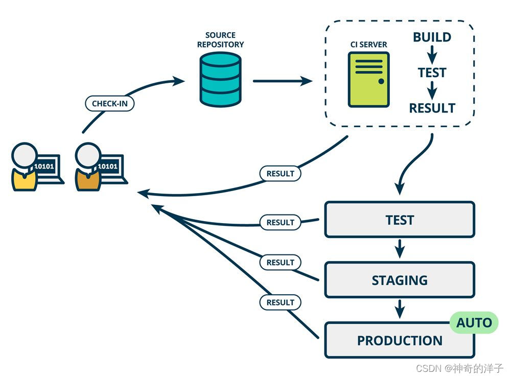

CI/CD的全称是Continuous Integration and Continuous Delivery/Deployment，中文翻译为“持续集成和持续交付/部署”。

CI/CD是一种软件开发流程模型，旨在通过自动化和持续性的构建、测试、部署和交付过程，来提高软件开发和发布的效率和质量。

CI/CD的目标是缩短软件开发和发布的周期，降低开发和发布的成本和风险，以满足快速变化和不断迭代的业务需求。通常，CI/CD包括以下几个环节：

- 持续集成（Continuous Integration，CI）：开发人员将代码不断地提交到源代码管理系统中，该过程中，自动化的测试和构建工具会自动从源代码库中获取最新的代码，进行编译、测试、打包等操作，并生成相应的构建产物。

- 持续交付（Continuous Delivery，CD）：将构建产物部署到测试环境，进行测试和验证，最终生成可部署的产物。

- 持续部署（Continuous Deployment，CD）：将构建产物部署到生产环境，实现自动化的部署和发布，从而实现快速的交付和迭代。

#### 持续集成(Continuous integration，Cl)

> 大师 Martin Fowler 对持续集成是这样定义的:  持续集成是一种软件开发实践，即团队开发成员经常集成他们的工作，通常每个成员每天至少集成一次，也就意味着每天可能会发生多次集成。每次集成都通过自动化的构建(包括编译，发布，自动化测试)来验证,
> 从而尽快地发现集成错误。许多团队发现这个过程可以大大减少集成的问题，让团队能够更快的开发内聚的软件

通俗的来讲，持续集成就是在开发写完代码后，提交代码准入后自动触发的一系列流程，主要包括:

- 代码编译
- 代码打包
- 单元测试
- 代码静态扫描分析
- UI、接口自动化测试

持续集成(CI)可以帮助开发人员更加频繁地(有时甚至每天)将代码更改合并到共享分支或"主干"(master分支)中，另外通过持续集成当中的 单元测试、代码扫描、自动化测试 我们可以尽早发现新提交的代码引入的问题，从而更加快速修复这些错误.

#### 持续交付(Continuous Delivery，CD)
完成以上CI 的流程后，持续交付可自动将已验证的代码发布到存储代码库。为了实现高效的持续交付流程，务必要确保 CI已内置于开发管道。持续交付的目标是拥有一个可随时部署到生产环境的代码库， 
在持续交付中，每个阶段 ( 从代码更改的合并，到生产就绪型构建版本的交付)都涉及  测试自动化**和**代码发布自动化。在流程结束时，运维团队可以快速、轻松地将应用部署到生产环境中。注意，持续交付在自动化测试和集成结束后，具备部署的能力，但不会自动部署，而是手动部署。如果有自动部署，则是 持续部署 的概念了。

#### 持续部署(Continuous Deployment，CD)
对于一个成熟的 CI/CD 管道来说，最后的阶段是**持续部署**。作为持续交付--自动将生产就绪型构建版本发布到代码存储库--的延伸，持续部署可以 自动将应用发布到生产环境
由于在生产之前的管道阶段没有手动门控，因此持续部署在很大程度上都得依赖精心设计的自动化测试
实际上，持续部署意味着开发人员对应用的更改在编写后的几分钟内就能生效(假设它通过了自动化测试)。这更加便于持续接收和整合用户反馈。总而言之，所有这些 CI/CD 的关联步骤都有助于降低应用的部署风险，因此更便于**以小件的方式**(而非一次性)发布对应用的更改。不过，由于还需要编写自动化测试以适应 CI/CD 管道中的各种测试和发布阶段。

#### CI/CD小结
- 持续集成:  高频率的将代码合入主干，在合入之前触发单测和集成测试等去验证代码的改动，确保改动不会对应用造成破坏
- 持续交付:  将代码合入到代码仓库。其目标是拥有一个可随时部署到生产环境的代码库
- 持续部署:  在流程结束时，运维团队可以快速、轻松地将应用部署到生产环境

#### CI/CD 工具
CI/CD 集成于 CI/CD 工具及代码托管服务。CI/CD 有时也可理解为进行 CI/CD 的构建服务器，而提供 CI/CD 的服务，如以下产品，将会提供构建服务与 GitHub/GitLab 集成在一起

- Jenkins

- GitLab Cl/CD

- Travis Cl

  若公司没有 CI/CD 基础设施，那么可以尝试 github 免费的 CICD 服务 GitHub Actions
  若公司以 GitLab Cl 作为 CI/CD 工具，此时需要自建 GitLab Runner 作为构建服务器
  在互联网大厂，一般是有自研的CI/CD 工具

 #### CI/CD 配置文件
CI/CD 流水线(pipelimne)的配置文件使用的便是 yaml 语法写的，因此需要先理解一下相关的语法。这里推荐通过阮一峰老师的文章学习 https://www.ruanyifeng.com/blog/2016/07/yaml.html
以下为 GitLab CI/CD 完整 pipeline 的配置文件 gitlab-ci.yml，该配置中一共是三个阶段 stage:  build、test、 deploy; 这三个阶段合在一起描述了代码上库之后的需要进行的处理，分别是代码构建(编译)、测试、部署阶段
各阶段执行的顺序为，build(构建) => test(测试) => deploy(部署)
在每个阶段，我们可以设置对应的任务job。以编译阶段为例，就用echo打印了下"build project"这个字符串，然后执行了 make -f Makefile 命令进行编译

在实践过程中，可以根据需要创建三条pipeline，触发时机分别为

- ChangePipeline:  代码提交后，入库前自动触发
- BranchPipeline:  代码入库后，发布前自动触发
- MasterPipeline:  合入主干时自动触发