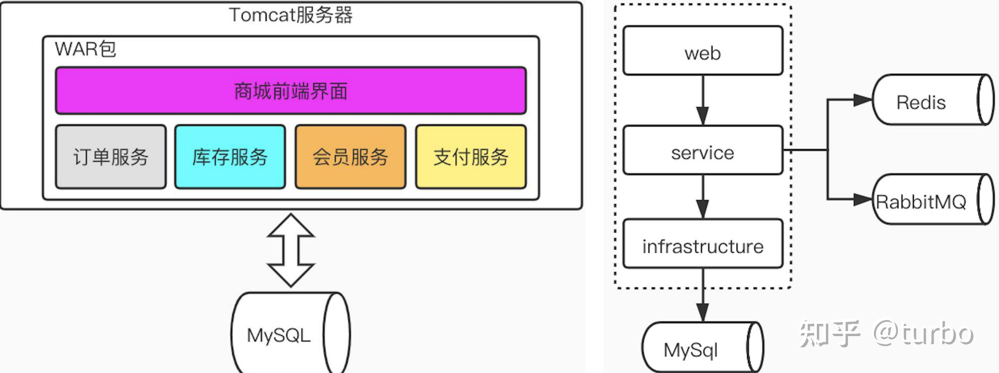
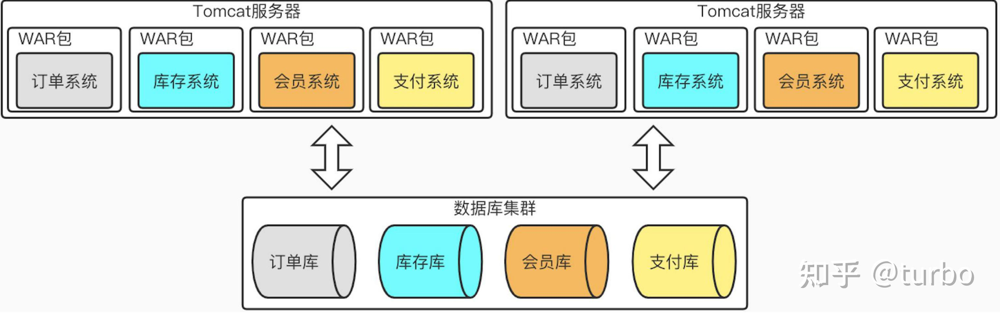
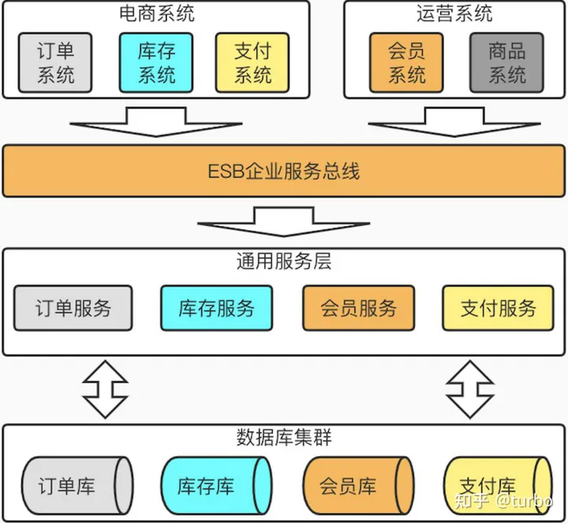
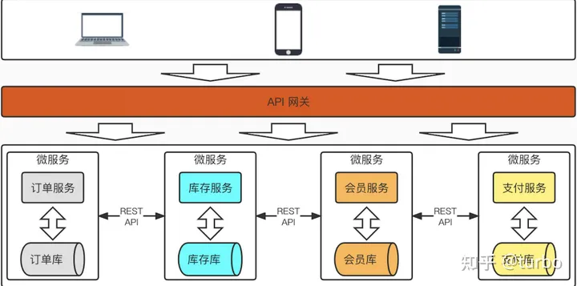
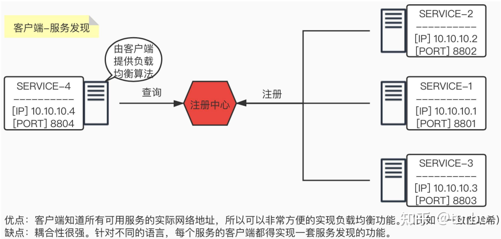
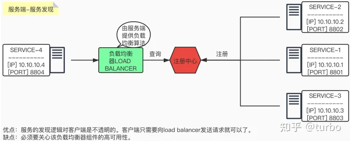
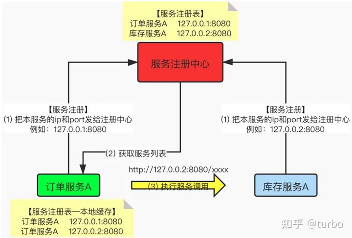
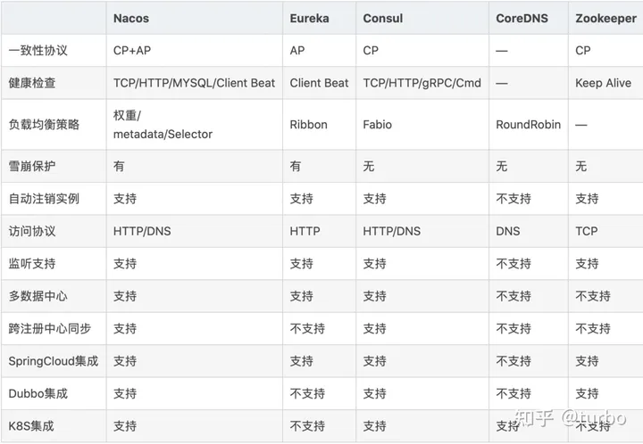
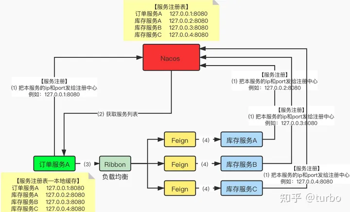
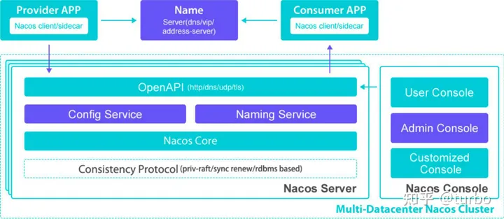

# 微服务-服务发现

## 服务演变 - 从单体服务到微服务

### 单体服务 - All in one

在微服务概念出来前，一般一个项目中包含了所有的功能模块服务，然后一起开发、编译、测试与部署。通常来说，是一个发布安装包里面（如，JAVA war包/jar包）包含一个应用的所有功能，则我们称这种架构为单体架构。即：所有服务都在service模块中。如下图所示：

**优点**：

- 1 架构简单，清晰。服务之间调用方便，快捷。
- 2 服务部署简单。部署量少。运维量很低。

**缺点**：

- 1 随着项目进展时间变长，整个项目的**代码复杂度越来越高**，很容易一个小改动，导致很大的系统问题。
- 2 由于代码量很大，**编译和部署会越来越慢**，甚至20~30分钟都很正常。
- 3 通常服务功能属于大量运算的**CPU密集型**模块，有的是大量读写磁盘的**IO密集型**模块。但是由于融合在了一个项目中，无法针对单个功能模块进行**扩展**。那么,**只能CPU和内存和磁盘都要提升，资源投入很大**。
- 4 如果我们想要针对已有项目改变技术选型，那么就需要针对整个项目进行修改，工作量将会巨大。

### 集群级垂直化

随着用户量越来越大，服务器负载也随之增高，用户需求导致对产品的需求也会剧增。那么这一个 项目工程，如 war包，中的代码量也会越来越大，面临着每一次代码修改（无论小修改还是大迭代），都要把整个项目工程的代码重新测试和部署，而且部署时间也会非常的漫长。针对这种情况，我们进行如下优化：

- 1> 通过**横向增加服务器**，把单台机器变成多台机器的集群。
- 2> **按照业务的垂直领域进行拆分**，减少业务的耦合度，以及降低单个war包带来的伸缩性困难的问题。

### SOA

核心目标是把一些**通用的**、会被多个上层服务调用的**共享业务提取成独立的基础服务**，这些被提取出来的共享服务想对来说比较独立，并且可以重用。所以在SOA中，服务是最核心的抽象手段，业务被划分为一些粗粒度的业务服务和业务流程。

SOA主要解决的问题是：

- 1> **信息孤岛。**
- 2> **共享业务的重用。**

 

### 微服务

被SOA拆分出来的服务是否也需要以**业务功能为维度**来进行拆分和独立部署，以降低业务的耦合及提升容错性？微服务就是这样一种解决方案。我们可以**把SOA看成微服务的超集**，也就是**多个微服务可以组成一个SOA服务**。

伴随着服务颗粒化的细化，会导致原本10个服务可能拆分成了100个微服务，一旦服务规模扩大，就意味着服务的构建、发布、运维的复杂度也会成倍增加。

优点：

- 1> 每个服务足够小，足够内聚，**专注于一个业务功能点**提供服务。代码更容易理解。
- 2> 有**代码修改**或**部署上线**，只会影响对应的微服务，而不会是整个服务。
- 3> 可针对服务是**计算型**还是**IO型**进行针对性的**硬件升级**。
- 4> 可以针对某些**高吞吐服务**进行硬件升级或者服务横向扩容，而不是对所有服务都升级，**节约投入成本**。

缺点：

- 1> 极大的**增加了运维工作量**，以前几个war包，现在可能需要部署几百个。
- 2> 微服务之间的互相调用，会**增加通讯成本**。
- 3> 分布式事务问题会引出**数据一致性**的问题。
- 4> 服务增多，如果管控成百上千的服务。如何准确并快速**定位问题**。

### SOA与微服务的区别

SOA关注的是**服务的重用性**及解**决信息孤岛问题**。

微服务关注的是**解耦**，虽然解耦和可重用性从特定的角度来看是一样的，但本质上是有区别的；

- **解耦**：降低业务之间的耦合度。
- **重用性**：关注的是服务的复用。

微服务会更多地关注在DevOps的持续交付上，因为服务粒度细化之后使得开发运维变得更加重要，因此微服务与容器化技术的结合更加紧密。

## 服务发现介绍

在传统的系统部署中，服务运行在一个**固定的已知的IP和端口上**，如果一个服务需要调用另一个服务，那么可以通过地址直接调用。但是，在虚拟化或者容器化的环境中，**服务实例的启动和销毁是很频繁的**，那么**服务地址也是在动态变化**的。这种情况下，就需要服务发现机制了。服务发现的方式有如下两种：

### **客户端——服务发现 （client-side service discovery）**

客户端通过查询服务注册中心，获取可用服务的实际网络地址（IP&PORT）。然后通过负载均衡算法来选择一个可用的服务实例，并将请求发送至该服务。

在服务启动的时候，向服务注册中心注册服务；在服务停止的时候，向服务注册中心注销服务。服务注册的一个典型实现方式就是通过**heartbeat机制（心跳机制）**定时刷新。

### **服务端——服务发现 （server-side service discovery）**

客户端向load balancer上发送请求。load balancer查询服务注册中心，找到可用的服务，然后转发请求到该服务上。和客户端发现一样，服务都要到注册中心进行服务的注册和销毁。

### 服务发现调用流程

### 服务发现技术对比

## Nacos简介

[https://nacos.io/zh-cn/](https://link.zhihu.com/?target=https%3A//nacos.io/zh-cn/)

Nacos是阿里的一个开源产品，它是针对微服务架构中的**服务发现**、**配置管理**、**服务治理**的综合型解决方案。

官方介绍如下：

- 致力于帮助您发现、配置和管理微服务。
- 提供了一组简单易用的特性集，帮助您快速实现动态服务发现、服务配置、服务元数据及流量管理。
- 帮助您更敏捷和容易地构建、交付和管理微服务平台。
- 是构建以“服务”为中心的现代应用架构 (例如微服务范式、云原生范式) 的服务基础设施。

### Nacos特性

Nacos主要提供以下**四大功能**：

**1）服务发现与服务健康检查**

Nacos使服务更容易注册，并通过**DNS**或**HTTP**接口发现其他服务；Nacos还提供服务的**实时健康检查**，以防止向不健康的主机或服务实例发送请求。

2）**动态配置服务**

动态配置服务运行在所有环境中以集中和动态的方式管理所有服务的配置。Nacos消除了在更新配置时重新部署应用程序，这使配置的更改更加高效和灵活

3）**动态DNS服务**

Nacos提供基于**DNS协议**的服务发现能力，旨在**支持异构语言**的服务发现；支持将注册在Nacos上的服务以**域名**的方式暴露端点，让三方应用方便查阅及发现。

4）**服务和元数据管理**

Nacos能让您从微服务平台建设的视角管理数据中心的所有服务及元数据（即：服务相关的一些配置和状态信息）包括：管理服务的描述、生命周期、服务的静态依赖分析、服务的健康状态、服务的流量管理、路由及安全策略。

### 快速入门

服务协作流程

Spring Cloud常见集成方案

【注】

- Ribbon：基于客户端的负载均衡。
- Feign：可以帮我们更快捷、优雅地调用HTTP API。将HTTP报文请求方式伪装为简单的java接口调用方式。

### Nacos架构图

**Provider APP ：**服务提供者

**Consumer APP ：**服务消费者

**Name Server：**通过VIP（Vritual IP）或者DNS的方式实现Nacos高可用集群的服务路由。

**Nacos Server ：**Nacos服务提供者，里面包含：

- Open API：功能访问入口。
- Config Service：配置服务模块。在服务或者应用运行过程中，提供动态配置或者元数据以及配置管理的服务提供者。
- Naming Service：名字服务模块。提供分布式系统中所有对象(Object)、实体(Entity)的“名字”到关联的元数据之间的映射管理服务，服务发现和DNS就是名字服务的2大场景。
- Consistency Protocol：一致性协议，用来实现Nacos集群节点的数据同步。使用Raft算法（使用类似算法的中间件还有Etcd、Redis哨兵选举等）。
- Nacos Console：Nacos的控制台。
- 