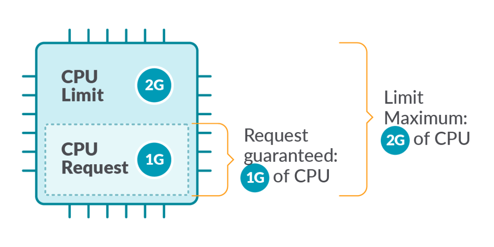
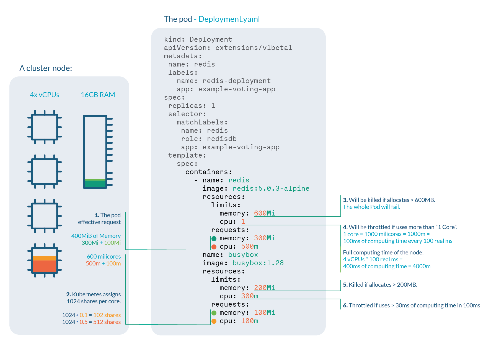
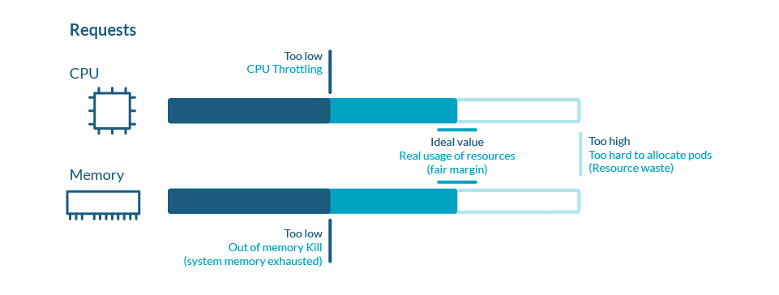
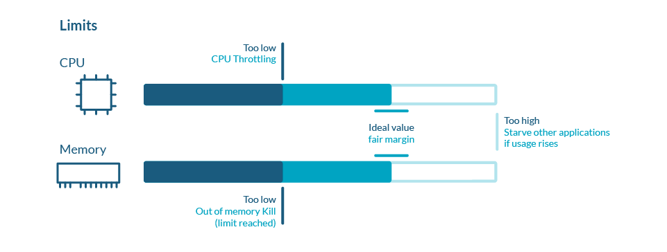
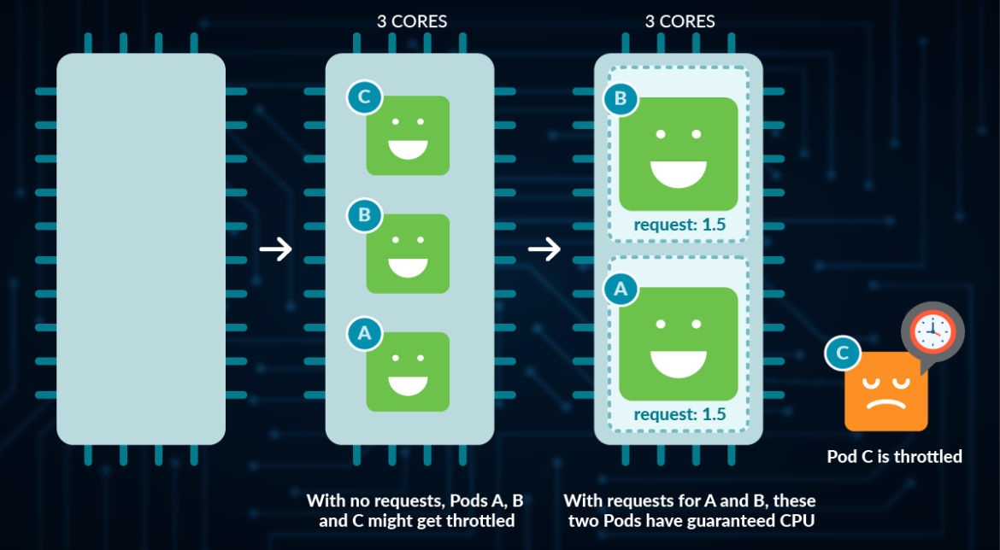
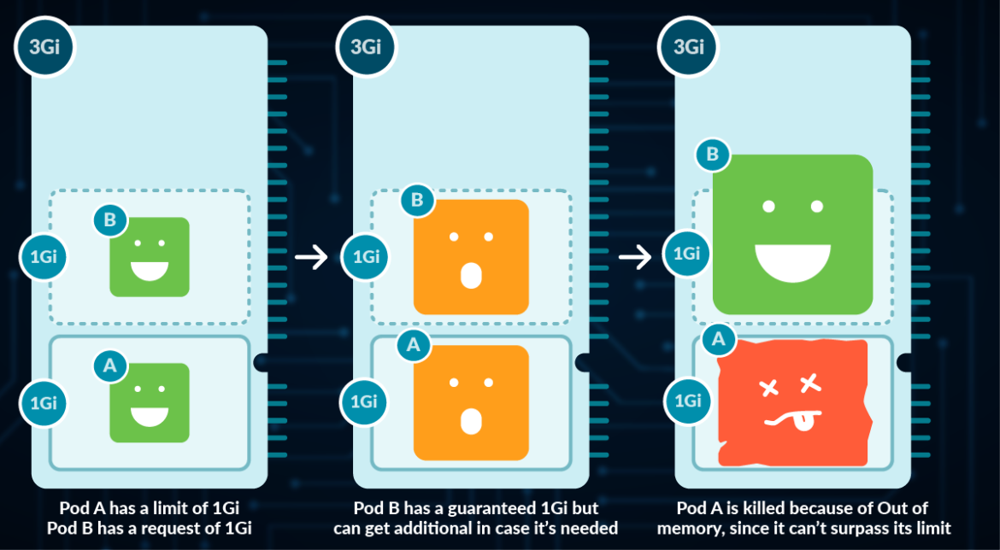

# Understanding Kubernetes Limits and Requests

When working with containers in Kubernetes, it's important to know what are the resources involved and how they are needed.  Some processes will require more CPU or memory than others. Some are critical and should never be starved.

Knowing that, we should configure containers and Pods properly in order to get the best of both.

In this article, we will see:

- [Introduction to Kubernetes Limits and Requests](https://sysdig.com/blog/kubernetes-limits-requests/#introduction)

- [Hands-on example](https://sysdig.com/blog/kubernetes-limits-requests/#handson)

- [Kubernetes Requests](https://sysdig.com/blog/kubernetes-limits-requests/#kubernetesrequests)

- [Kubernetes Limits](https://sysdig.com/blog/kubernetes-limits-requests/#kuberneteslimits)

- [CPU particularities](https://sysdig.com/blog/kubernetes-limits-requests/#cpuparticularities)

- [Memory particularities](https://sysdig.com/blog/kubernetes-limits-requests/#memoryparticularities)

- [Namespace ResourceQuota](https://sysdig.com/blog/kubernetes-limits-requests/#namespaceresourcequota)

- [Namespace LimitRange](https://sysdig.com/blog/kubernetes-limits-requests/#namespacelimitrange)

  ## Introduction to Kubernetes Limits and Requests

  Limits and Requests are important settings when working with Kubernetes. This article will focus on the two most important ones: CPU and memory.

  **Kubernetes defines Limits as the** **maximum amount of a resource** to be used by a container. This means that the container can never consume more than the memory amount or CPU amount indicated. 

  **Requests, on the other hand, are the minimum guaranteed amount of a resource** that is reserved for a container.

  

  ## Hands-on Sample

  Let's have a look at this deployment, where we are setting up limits and requests for two different containers both for CPU and memory.

  ```yaml
  kind: Deployment
  apiVersion: extensions/v1beta1
  …
  template:
    spec:
      containers:
        - name: redis
          image: redis:5.0.3-alpine
          resources:
            limits:
              memory: 600Mi
              cpu: 1
            requests:
              memory: 300Mi
              cpu: 500m
        - name: busybox
          image: busybox:1.28
          resources:
            limits:
              memory: 200Mi
              cpu: 300m
            requests:
              memory: 100Mi
              cpu: 100mCode language: JavaScript (javascript)
  ```

  Let’s say we are running a cluster with, for example, 4 cores and 16GB RAM nodes. We can extract a lot of information:



1. **Pod effective request** is 400 MiB of memory and 600 millicores of CPU. You need a node with enough free allocatable space to schedule the pod.
2. **CPU shares** for the redis container will be 512, and 102 for the busybox container. Kubernetes always assign 1024 shares to every core, so redis: 1024 * 0.5 cores ≅ 512 and busybox: 1024 * 0.1cores ≅ 102
3. Redis container will be **OOM killed** if it tries to allocate more than 600MB of RAM, most likely making the pod fail.
4. Redis will suffer **CPU throttle** if it tries to use more than 100ms of CPU in every 100ms, (since we have 4 cores, available time would be 400ms every 100ms) causing performance degradation.
5. Busybox container will be **OOM killed** if it tries to allocate more than 200MB of RAM, resulting in a failed pod.
6. Busybox will suffer **CPU throttle** if it tries to use more than 30ms of CPU every 100ms, causing performance degradation.


## Kubernetes Requests

Kubernetes defines requests as a **guaranteed minimum amount of a resource** to be used by a container.

Basically, it will set the minimum amount of the resource for the container to consume.

When a Pod is scheduled, kube-scheduler will check the Kubernetes requests in order to allocate it to a particular Node that can satisfy at least that amount for all containers in the Pod. If the requested amount is higher than the available resource, the Pod will not be scheduled and remain in Pending status.

For more information about Pending status, check [Understanding Kubernetes Pod pending problems](https://sysdig.com/blog/kubernetes-pod-pending-problems/).

In this example, in the container definition we set a request for 100m cores of CPU and 4Mi of memory:

```yaml
resources:
   requests:
        cpu: 0.1
        memory: 4MiCode language: JavaScript (javascript)
```

Requests are used:

- When allocating Pods to a Node, so the indicated requests by the containers in the Pod are satisfied.
- At runtime, the indicated amount of requests will be guaranteed as a minimum for the containers in that Pod.



## Kubernetes Limits

Kubernetes defines **limits** as a **maximum amount of a resource** to be used by a container.

This means that the container can never consume more than the memory amount or CPU amount indicated.

```
    resources:
      limits:
        cpu: 0.5
        memory: 100Mi
Code language: JavaScript (javascript)
```

Limits are used:

- When allocating Pods to a Node. If no requests are set, by default, Kubernetes will assign requests = limits.
- At runtime, Kubernetes will check that the containers in the Pod are not consuming a higher amount of resources than indicated in the limit.



## CPU particularities

CPU is a **compressible resource**, meaning that it can be stretched in order to satisfy all the demand. In case that the processes request too much CPU, some of them will be throttled.

**CPU** represents **computing processing time**, measured in cores. 

- You can use millicores (m) to represent smaller amounts than a core (e.g., 500m would be half a core)
- The minimum amount is 1m
- A Node might have more than one core available, so requesting CPU > 1 is possible



## Memory particularities

**Memory** is a **non-compressible** resource, meaning that it can’t be stretched in the same manner as CPU. If a process doesn’t get enough memory to work, the process is killed.

Memory is measured in Kubernetes in **bytes**.

- You can use, E, P, T, G, M, k to represent Exabyte, Petabyte, Terabyte, Gigabyte, Megabyte and kilobyte, although only the last four are commonly used. (e.g., 500M, 4G)
- Warning: don’t use lowercase m for memory (this represents Millibytes, which is ridiculously low)
- You can define Mebibytes using Mi, as well as the rest as Ei, Pi, Ti (e.g., 500Mi)

**A Mebibyte (and their analogues Kibibyte, Gibibyte,…) is 2 to the power of 20 bytes. It was created to avoid the confusion with the Kilo, Mega definitions of the metric system. You should be using this notation, as it’s the canonical definition for bytes, while Kilo and Mega are multiples of 1000\*
*



## Best practices

In very few cases should you be using limits to control your resources usage in Kubernetes. This is because if you want to avoid starvation (ensure that every important process gets its share), you should be using requests in the first place. 

By setting up limits, you are only preventing a process from retrieving additional resources in exceptional cases, causing an OOM kill in the event of memory, and Throttling in the event of CPU (process will need to wait until the CPU can be used again).

For more information, check the [article about OOM and Throttling](https://sysdig.com/blog/troubleshoot-kubernetes-oom/).

If you’re setting a request value equal to the limit in all containers of a Pod, that Pod will get the Guaranteed Quality of Service. 

Note as well, that Pods that have a resource usage higher than the requests are more likely to be evicted, so setting up very low requests cause more harm than good. For more information, check the article about [Pod eviction and Quality of Service](https://sysdig.com/blog/kubernetes-pod-evicted/).

## Namespace ResourceQuota

Thanks to namespaces, we can isolate Kubernetes resources into different groups, also called tenants.

With **ResourceQuotas**, you can **set a memory or CPU limit to the entire namespace**, ensuring that entities in it can’t consume more from that amount.

```yaml
apiVersion: v1
kind: ResourceQuota
metadata:
  name: mem-cpu-demo
spec:
  hard:
    requests.cpu: 2
    requests.memory: 1Gi
    limits.cpu: 3
    limits.memory: 2Gi

Code language: JavaScript (javascript)
```

- requests.cpu: the maximum amount of CPU for the sum of all requests in this namespace
- requests.memory: the maximum amount of Memory for the sum of all requests in this namespace
- limits.cpu: the maximum amount of CPU for the sum of all limits in this namespace
- limits.memory: the maximum amount of memory for the sum of all limits in this namespace

Then, apply it to your namespace:

```yaml
kubectl apply -f resourcequota.yaml --namespace=mynamespace
Code language: JavaScript (javascript)
```

You can list the current ResourceQuota for a namespace with:

```sh
kubectl get resourcequota -n mynamespace
Code language: JavaScript (javascript)
```

Note that if you set up ResourceQuota for a given resource in a namespace, you then need to specify limits or requests accordingly for every Pod in that namespace. If not, Kubernetes will return a “failed quota” error:

```
Error from server (Forbidden): error when creating "mypod.yaml": pods "mypod" is forbidden: failed quota: mem-cpu-demo: must specify limits.cpu,limits.memory,requests.cpu,requests.memory
Code language: JavaScript (javascript)
```

In case you try to add a new Pod with container limits or requests that exceed the current ResourceQuota, Kubernetes will return an “exceeded quota” error:

```
Error from server (Forbidden): error when creating "mypod.yaml": pods "mypod" is forbidden: exceeded quota: mem-cpu-demo, requested: limits.memory=2Gi,requests.memory=2Gi, used: limits.memory=1Gi,requests.memory=1Gi, limited: limits.memory=2Gi,requests.memory=1Gi
Code language: JavaScript (javascript)
```

## Namespace LimitRange

ResourceQuotas are useful if we want to restrict the total amount of a resource allocatable for a namespace. But what happens if we want to give default values to the elements inside?

**LimitRanges** are a Kubernetes policy that **restricts the resource settings for each entity** in a namespace.

```yaml
apiVersion: v1
kind: LimitRange
metadata:
  name: cpu-resource-constraint
spec:
  limits:
  - default:
      cpu: 500m
    defaultRequest:
      cpu: 500m
    min:
      cpu: 100m
    max:
      cpu: "1"
    type: Container
Code language: JavaScript (javascript)
```

- `default`: Containers created will have this value if none is specified.
- `min`: Containers created can’t have limits or requests smaller than this.
- `max`: Containers created can’t have limits or requests bigger than this.

Later, if you create a new Pod with no requests or limits set, LimitRange will automatically set these values to all its containers:

```yaml
    Limits:
      cpu:  500m
    Requests:
      cpu:  100m
Code language: JavaScript (javascript)
```

Now, imagine that you add a new Pod with 1200M as limit. You will receive the following error:

```
Error from server (Forbidden): error when creating "pods/mypod.yaml": pods "mypod" is forbidden: maximum cpu usage per Container is 1, but limit is 1200m
Code language: JavaScript (javascript)
```

Note that by default, all containers in Pod will effectively have a request of 100m CPU, even with no LimitRanges set.

## Conclusion

Choosing the optimal limits for our Kubernetes cluster is key in order to get the best of both energy consumption and costs.

Oversizing or dedicating too many resources for our Pods may lead to **costs skyrocketing**.

Undersizing or dedicating very few CPU or Memory will lead to applications not performing correctly, or even Pods being evicted.

As mentioned, **Kubernetes limits shouldn’t be used **, except in very specific situations, as they may cause more harm than good. There’s a chance that a Container is killed in case of Out of Memory, or throttled in case of Out of CPU.

For requests, use them when you need to ensure a process gets a guaranteed share of a resource.

[](https://sysdig.com/wp-content/uploads/kubernetes-resources-cheatsheet-1170x585.png)

------

https://sysdig.com/blog/troubleshoot-kubernetes-oom/

# Understanding Kubernetes Evicted Pods

What does it mean that Kubernetes Pods are evicted? They are terminated, usually the result of not not having enough resources. But why does this happen?

**Evicted** is a process where a **Pod**  assigned to a Node is asked for terminates. One of the most common case in Kubernetes is Preemption, where in order to schedule a new Pod in a Node with limited resources, another Pod needs to be terminated to leave resources to the first one.

Also, Kubernetes constantly checks resource and evicts Pods if needed, a process called **Node-pressure eviction**.

> Every day, thousands of Pods are evicted from their homes. Stranded and confused, they have to abandon their previous lifestyle. Some of them even become nodeless. The current society, imposing higher demands of CPU and memory, is part of the problem.

During this article, you will discover:

- [Reasons why Pods are evicted: Preemption and Node-pressure](https://sysdig.com/blog/kubernetes-pod-evicted/#reasonswhypodsareevicted)
- [Preemption eviction](https://sysdig.com/blog/kubernetes-pod-evicted/#preemptioneviction)
- [Pod Priority Classes](https://sysdig.com/blog/kubernetes-pod-evicted/#podpriorityclasses)
- [Node-pressure eviction](https://sysdig.com/blog/kubernetes-pod-evicted/#nodepressureeviction)
- [Quality of Service Classes](https://sysdig.com/blog/kubernetes-pod-evicted/#qosclasses)
- [Other types of eviction](https://sysdig.com/blog/kubernetes-pod-evicted/#othertypeseviction)
- [Kubernetes Pod eviction monitoring in Prometheus](https://sysdig.com/blog/kubernetes-pod-evicted/#podevictionprometheus)

## Reasons why Pods are evicted: Preemption and Node-pressure

There are several reasons why Pod eviction can happen in Kubernetes. The most important ones are:

- Preemption
- Node-pressure eviction

## Preemption eviction

Preemption is the follow process: if a new Pod needs to scheduled but doesn't have any suitable Node with enough resources, then kube-scheduler will check if by evicting(terminating) some Pods with low priority the new Pod can be part of that Node.

let's first understand how Kubernetes scheduling works.

#### Pod Scheduling

Kubernetes Scheduling is the process where Pods are assigned to nodes.

By default, there's a Kubernetes entity responsible for scheduling, called `kube-scheduler` which will running in the control plane. The Pod will start in the Pending state until a matching node is found.

The process of assigning a Pod to a Node follows this sequence:

1. Filtering
2. Scoring

#### Filtering

During the **Filtering step,** `kube-scheduler` will **select** all Nodes **where the current Pod might be placed**.  Features like Taint and Tolerations will be taken into account here. Once finished, it will have a list of suitable Nodes for that Pod.

 ### Scoring

During the **Scoring step**, `kube-scheduler` will take the resulting list from previous step and assign a score to each of the nodes. This way, candidate nodes are ordered from most suitable to least. In case two nodes have the sane score, kuber-scheduler orders the randomly.
