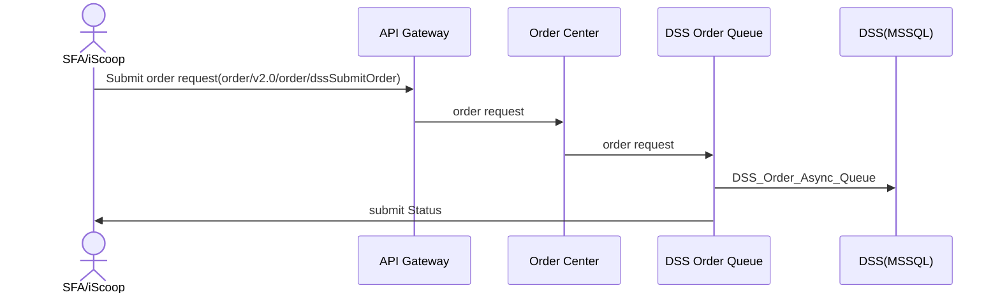
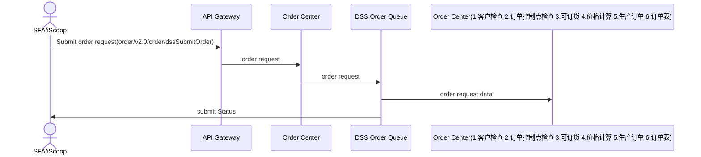
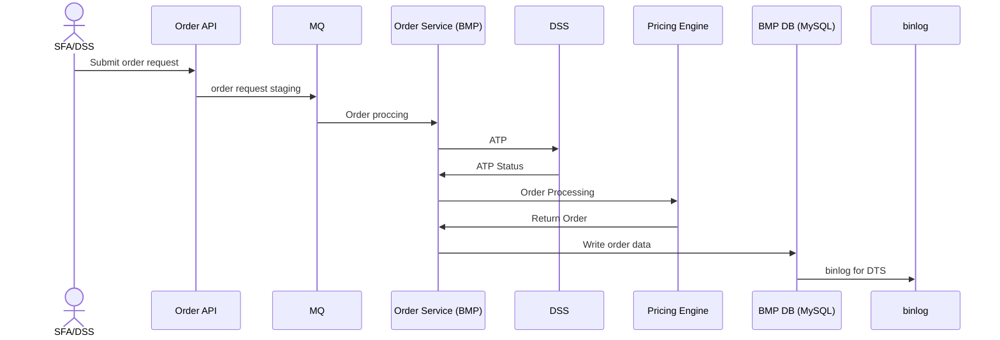
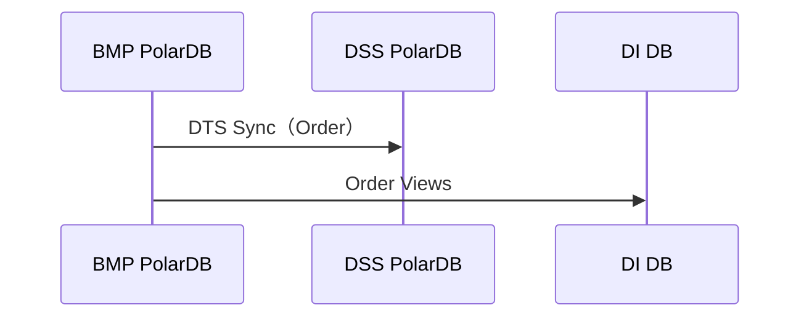
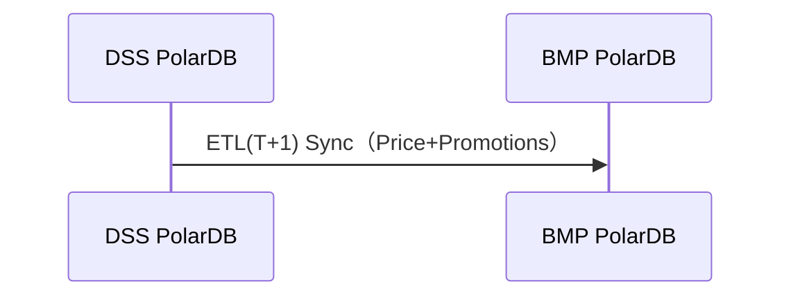

# 业务中台 - 订单分派架构

## 一、方案整体概述

本方案围绕 “业务中台提供订单创建 API→MQ 解耦→订单控制点检查→可订货库存检查→价格引擎处理→订单消费” 的核心链路，构建高可用、可扩展、低耦合的订单创建服务架构。通过引入消息队列（MQ）实现服务解耦，避免上游 API 与下游价格引擎强依赖；通过订单价格引擎统一处理计价、规则校验等核心逻辑，确保订单数据一致性；通过双库存储满足不同业务场景（如交易核心库、报表分析库）的数据需求，同时提供数据容灾能力。

## 二、核心架构设计

### 1. 架构分层与组件职责

采用 “分层解耦” 设计思想，将整体架构分为 5 层，各层组件及职责如下表所示：

| 架构分层     | 核心组件          | 组件职责                                                     | 技术选型建议               |
| ------------ | ----------------- | ------------------------------------------------------------ | -------------------------- |
| 接入层       | 订单创建 API 网关 | 1. 接收前端 / 第三方系统的订单创建请求；2. 完成请求鉴权（如API 密钥）、参数校验（必填项、格式校验）；3. 流量控制（限流、熔断），防止峰值流量压垮下游服务；4. 请求路由至业务中台订单创建服务 | API云原生网关              |
| 业务中台层   | 订单创建服务      | 1. 接收 API 网关转发的合法请求，初步封装订单基础数据（如生成请求唯一 ID、填充中台公共字段）；2. 校验订单基础规则；3. 将订单数据格式化为 MQ 标准消息，发送至 “订单创建请求队列”；4. 提供订单创建状态查询接口（基于 MQ 消息 ID 或订单请求 ID） | Spring Boot / Spring Cloud |
| 消息中间件层 | 订单创建请求队列  | 1. 解耦订单创建服务与订单价格引擎，实现异步通信；2. 消息持久化（防止服务宕机丢失数据）；3. 消息重试机制（失败后按策略重试，避免瞬时故障导致订单丢失）；4. 死信队列（重试多次失败的消息转入死信队列，供人工排查） | RabbitMQ                   |
| 业务处理层   | 订单检查点        | 客户检查、可订货、最低起订量、上下限等                       | Spring Boot / Spring Cloud |
| 业务处理层   | 订单价格引擎      | 1. 监听 “订单创建请求队列”，消费订单消息；2. 核心业务逻辑处理：   - 价格计算（商品原价、折扣、优惠券、税费）；   - 订单合法性校验（库存扣减、用户权限、支付方式）；   - 订单号生成（全局唯一，如雪花算法）；3. 处理完成后，将订单数据发送至 “订单双库存储队列” | Spring Boot / 自研规则引擎 |
| 数据存储层   | 数据库集群        | 1. 主交易库（MySQL 集群）：   - 存储核心交易数据（订单头、订单明细）；   - 支持高并发读写，保障交易实时性；   - 开启 binlog，用于数据同步和恢复；2. 副分析库：   - 存储订单全量数据，供DSS业务处理、报表分析、数据挖掘使用；   - 支持批量写入和复杂查询，不影响主库性能 | Polar-MySQL（主库）        |

### 2. 关键组件设计细节

#### （1）订单创建 API 网关

*   **鉴权机制**：集成统一身份认证服务（如 AppKey），前端请求携带 Token，网关验证 Token 有效性后放行；

*   **参数校验**：基于 JSON Schema 校验请求参数（如订单金额非负、商品 ID 非空、收货地址格式正确），校验失败直接返回 400 错误；

*   **流量控制**：采用令牌桶算法，设置单 IP / 单用户的 QPS 上限（如 100 QPS），超过上限返回 429 错误，保护下游服务；

*   **请求追踪**：为每个请求生成唯一 Trace ID，通过 HTTP 头传递至下游所有服务，便于日志排查。

#### （2）订单价格引擎

*   **规则可配置**：采用 “规则引擎 + 配置中心” 设计，价格计算规则（如折扣策略、税费公式）通过配置中心（Nacos / Apollo）动态调整，无需重启服务；

*   **分布式锁**：处理库存扣减时，使用 Redis 分布式锁，防止超卖（如同一产品多个订单同时扣减库存）；

*   **幂等性保障**：消费 MQ 消息时，基于 “消息 ID + 订单请求 ID” 双重去重，避免重复创建订单（如 MQ 重试导致消息重复消费）；

*   **事务补偿**：若价格计算失败（如优惠券已过期），主动发送 “订单创建失败” 消息至 MQ，触发上游服务的补偿逻辑（如释放预占库存）。

#### （3）数据库同步

*   **数据同步策略**：主库写入成功后，通过 MQ “订单双库存储队列” 异步同步至副库，避免主库写入被副库拖慢；

*   **数据一致性保障**：采用 “最终一致性” 模型，主库为核心数据源，副库通过定时任务（如每小时）校验与主库的数据差异，确保数据不丢失；

*   **存储分工**：主库仅保留近 6 个月的活跃订单数据（历史数据归档至冷存储），副库保留全量订单数据，兼顾性能与数据分析需求。

## 三、数据流设计

### 1. DSS订单数据流总链路（解耦、异步间接模式）


----





- 开发项：
   1.新Queue: dssorderqueue
   2.订单中心:  Order/v3.0/order/dssSubmitOrder 

    2.1参数JSON保持不变
    2.2.返回: 

 ```json
 
 3.1 提交成功
  {
     "message":"订单进入队列，等待处理!"
     "status":0
 }
 3.2 提交失败
 {
     
 }
   TBC 凌霄确认
 ```

​     3.OrderCreate：客户订单控制点、库存、价格计算

   4. BMP DB(MySql):

      表结构设计：订单表、DSS自定义价表表

      D/Q:创建

   5. 订单解析-> JAVA/DB

      ```json
      {"guid":"42753f4c-677d-4673-9d01-78e49020a73d"
      "companyNo":."3006"
      "orderNo":.""
      "sourceOrderNo":"FS12000012145"
      "partnerNo": "0510017722"
      "customerNo":."0510044376"
      "orderDate":"20200620171450"
      "createBy": "test"
      "systemSource":."Y011"
      "deliveryInstructions":"送货留言测试"
      "dispatchInstructions":"派单留言测试"
       ....
      }
      ```

      

   6. 子模块

      6.1.客户检查 ：

      6.2.订单控制点检查： REDIS？

      6.3.库存ATP：调用DSS API（参数与返回）

      6.4.价格计算 ：

      6.5.生产订单  -  订单表

   7. 子模块从DSS同步价格计算相关的数据
      7.1.客户价表 ： 

      ​			SAP价表： 业务中台

      ​			同步DSS自定义价表（如，沟通价等）到 价格中心

      7.2.促销： 

      ​			同步DSS促销表 到 价格中心： 业务中台

      7.3.客户订单控制点数据： 业务中台

      7.4基础数据：同步DSS基础 到基础数据中心（根据需要）

   8. DSS订单查询接口

    7.1.订单查询 ：order/v2.0/order/dssOrderSearch

  7.2 参数：

  7.3 返回：

  

   9. 其他接口

   10. MQ   works 模式

  MQ： https://www.rabbitmq.com/tutorials/tutorial-two-java

----

  


- 采用 “API 订单请求→MQ 消息→订单服务处理（订单、价格、ATP等）→业务中台存储” 的数据流，具体链路如下：



- MQ

  ```mermaid
  ---
  title: Order Dispatcher
  ---
  flowchart LR
  
   API[API]-->OrderRequestService["`OrderCenter
   _OrderRequestAPI_`"]-->mq["`MQ
      _Message Queue_`"]-->OrderCreateService["`OrderCenter
   _OrderCreateService_`"]
  
   
  
  ```

  - 开发项：
    1.Order-Service: Productor, Consumer
    2.SubmitDSSOrderRequest(json)
    3.OrderCreate：订单控制点、库存、价格计算
    4.Data archive

    5.DSS,DI date sync

  - 云资源：
    1.Docker： 3C，4G，2实例
    2.Rabbit MQ：峰值 QPS≤200; 可靠性要求高; 标准版（2 节点，16C32G）

    3.Redis: 4G

    4.Database: 4C,16G ，日增量300M/12万

    


  

- 订单数据同步（业务中台 →DSS, 业务中台→DI)


- 促销数据同步（DSS → 业务中台)

  
  
  




1. **请求发起**：前端 / 第三方系统组装订单数据（含用户 ID、商品列表等），发起订单创建 HTTP 请求；
2. **网关校验**：API 网关接收请求，先完成鉴权（验证 Token 有效性）、参数校验（检查必填字段、数据格式）、流量控制（判断是否超过 QPS 上限），校验不通过直接返回错误（如 401 未授权、400 参数错误、429 请求过频）；
3. **请求转发**：网关校验通过后，将请求转发至业务中台的 “订单创建服务”，并传递全局唯一 Trace ID（用于后续全链路追踪）；
4. **中台预处理**：订单创建服务接收请求，执行基础规则校验（如判断客户状态是否正常、可售卖产品，ATP检查（库存）等，并封装成标准订单消息格式；
5. **MQ 首次投递**：订单创建服务将封装好的订单消息发送至 MQ 的 “订单创建请求队列”，发送成功后立即向网关返回 “订单创建中” 的响应（避免上游系统等待）；
6. **引擎消费消息**：订单价格引擎监听 “订单创建请求队列”，当有新消息时，通过 “消息 ID + 订单请求 ID” 做幂等性校验（防止重复消费），校验通过后开始处理核心逻辑；
7. **引擎核心处理**：订单价格引擎完成三大核心操作：①价格计算（含商品原价、折扣、优惠券抵扣、税费计算）；②生成全局唯一订单号（如基于雪花算法）；③确认库存扣减（释放临时锁定库存，转为实际扣减）；
8. **MQ 二次投递**：订单价格引擎处理完成后，将包含最终订单数据（如订单号、订单状态等）的消息，发送至 MQ 的 “订单双库存储队列”；
9. **主库写入**：主交易库的监听服务消费 “订单双库存储队列” 消息，将核心交易数据（订单头、订单明细）写入主库，确保交易实时性；
10. **副库同步**：副分析库的监听服务同时消费 “订单双库存储队列” 消息，将全量订单数据写入副库，供后续报表分析使用；
11. **结果通知投递**：订单价格引擎在完成双库存储消息投递后，再发送 “订单创建结果” 消息（含成功 / 失败状态、失败原因）至 MQ 的 “订单状态通知队列”；
12. **中台接收结果**：订单创建服务监听 “订单状态通知队列”，接收并存储订单创建结果（如将结果写入本地缓存或状态表）；
13. **前端查询反馈**：前端 / 第三方系统通过 “订单请求 ID” 或 “用户 ID” 调用订单状态查询接口，订单创建服务从本地缓存 / 状态表获取结果，返回给前端（如 “订单创建成功，订单号 XXX” 或 “订单创建失败，原因：库存不足”）。

### 2. 关键数据流说明

#### （1）订单消息格式（MQ 传输）

采用 JSON 格式，包含 “公共字段 + 业务字段”，确保上下游服务数据解析一致性，示例如下：

```json
{
     "traceId": "trace-20240520-12345678", // 全局追踪ID
     "messageId": "mq-msg-87654321", // MQ消息唯一ID
     "createTime": "2024-05-20 14:30:00", // 消息创建时间
     "orderRequest": {
       "requestId": "req-98765432", // 订单请求唯一ID
       "userId": "user-12345", // 用户ID
       "orderItems": \[ // 订单商品明细
         {
           "productId": "67890",
           "productName": "可乐",
           "quantity": 1,
           "unitPrice": 59.00
         }
       ]
       }
     },
     "orderResult": { // 价格引擎处理后添加
       "orderId": "order-20240520-98765", // 生成的订单号
       "totalAmount": 5799.00, // 最终支付金额（扣减优惠券后）
       "status": "CREATED", // 订单状态（CREATED/FAILED）
       "failReason": "" // 失败原因（状态为FAILED时非空）
     }
}
```

#### （2）异常数据流处理


*   **MQ 消息消费失败**：订单价格引擎消费 “订单创建请求队列” 失败时，MQ 按 “3 次重试（每次间隔 5 秒）” 策略重试；重试失败后，消息转入 “订单创建死信队列”，由运维平台监控并触发人工排查（如优惠券系统故障、库存不足）；

*   **主库写入失败**：若主交易库写入失败（如数据库宕机），MQ “订单双库存储队列” 会重试写入（间隔 10 秒，共 5 次）；重试失败后，消息转入 “双库存储死信队列”，同时触发告警（短信 / 钉钉通知），人工介入修复后重新投递；

*   **数据同步不一致**：副库同步主库数据后，定时任务（每小时）对比 “订单 ID” 维度的数据差异，若发现副库缺失数据，自动从主库拉取补全；若发现数据不一致（如金额差异），触发告警并生成差异报表。

## 四、架构保障机制

### 1. 高可用性保障

*   **服务集群化**：订单创建服务、订单价格引擎均部署为多实例集群，通过注册中心（Nacos）实现服务发现，避免单点故障；

*   **MQ 高可用**：采用 MQ 集群部署（如 RocketMQ 的 NameServer 集群 + Broker 主从架构），确保消息队列不宕机；

*   **数据库高可用**：主交易库采用 MySQL 主从复制（1 主 2 从），主库故障时自动切换至从库；副分析库采用 MySQL 集群，支持多副本存储。

### 2. 可扩展性保障

*   **服务拆分**：核心逻辑按 “订单创建→价格计算→数据存储” 拆分，后续可独立扩展某一环节（如价格引擎压力大时，单独增加实例）；

*   **MQ Topic 分区**：“订单创建请求队列” 按 “用户 ID 哈希” 划分多个分区，提高消息消费并行度，支持流量增长时增加分区；

*   **数据库分库分表**：主交易库后续可按 “订单创建时间 + 用户 ID” 分库分表，支撑千万级订单量。

### 3. 可观测性保障

*   **日志采集**：所有服务通过 Logback 输出日志，携带 Trace ID，由 ELK（Elasticsearch+Logstash+Kibana）采集存储，支持按 Trace ID / 订单 ID 查询全链路日志；
*   **监控告警**：通过 Prometheus 采集服务指标（如 API QPS、MQ 消息堆积数、数据库写入延迟），Grafana 可视化展示；设置阈值告警（如 MQ 堆积超 1000 条时触发告警）；

## 五、总结

本方案通过 “分层架构 + MQ 解耦 + 双库存储”，实现了业务中台订单创建服务的**低耦合、高可用、可扩展**：

1.  **间接数据流**：通过 MQ 实现服务间异步通信，避免上游服务依赖下游服务状态，提高系统容错性；

2.  **架构设计**：核心组件职责清晰，支持独立扩展与维护，同时通过高可用、可观测性机制保障系统稳定运行；

3.  **业务适配**：双库存储兼顾交易实时性与数据分析需求，价格引擎规则可配置支持业务快速迭代，可满足中大型业务中台的订单创建场景。

